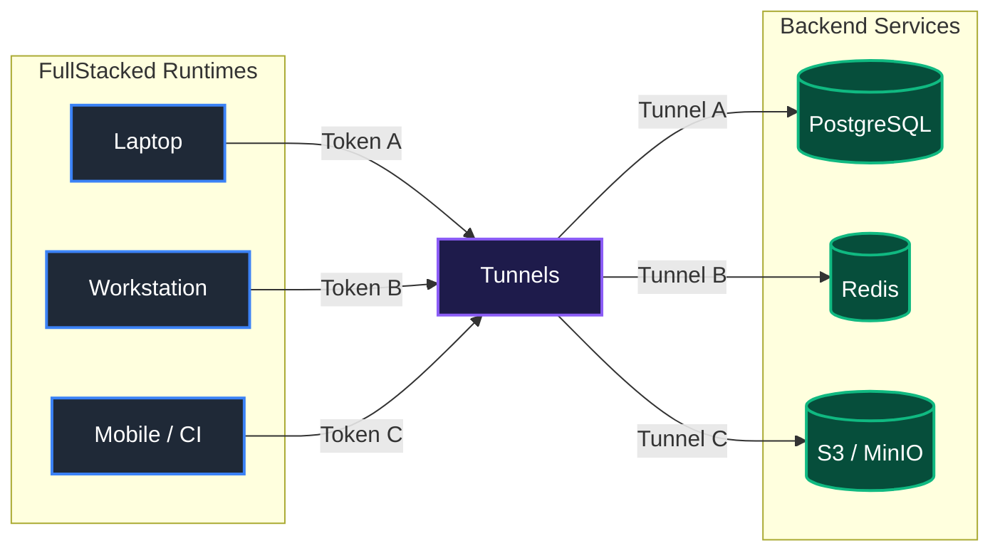

# FullStacked Tunnels

**FullStacked Tunnels** is a token-routed tunnel server that runs as a **Hub** or an **Edge**. It connects the **FullStacked runtime** to backend services (databases, caches, object storage, internal APIs), across the internet or a LAN, without port forwarding, static public IPs, or firewall changes on the private side.



---

## Principles

* **Protocol-agnostic**: raw bidirectional byte streams, no payload inspection. Works with PostgreSQL, MySQL/MariaDB, Redis, MongoDB, HTTP/1.1, HTTP/2, gRPC, and interactive SSH. TCP half-close is not propagated (see [Protocol Spec](docs/1-concepts/protocol-spec.md#symmetrical-teardown-no-half-close)).
* **Resilient**: every WebSocket runs a bidirectional heartbeat that keeps it alive through NATs, proxies, and load balancers and detects dead peers. Edges reconnect with exponential backoff and full jitter, and fall back to slow polling only when their credential is revoked.
* **Open by default, for tinkering**: no TLS setup, no admin credentials, no identity provider. Anyone can start a Hub on a laptop in seconds. Tokens are bearer secrets and are all a client needs.
* **Secured with hooks**: authentication, IP allowlists, signed requests, rate limits, and multi-tenancy are added with [hooks](docs/4-extensibility/hooks.md). See [Extending Security](docs/4-extensibility/extending-security.md).
* **Un-metered by default**: the core counts nothing; telemetry hooks expose the sockets so plugins can meter bytes and time sessions.
* **One codebase, two roles**: the same entry point runs a Hub, or an Edge when `HUB_URL` is set.

---

## Quickstart (Local, Zero Dependencies)

Requires Node.js 24 LTS or newer.

### 1. Start a Hub

```bash
node server/src/main.ts --port 3000
```

Filesystem storage in `./data`, in-memory KV, plain `ws://localhost:3000`.

### 2. Register a Tunnel

The Hub generates the token:

```bash
curl -X POST http://localhost:3000/tunnels \
  -H "Content-Type: application/json" \
  -d '{ "name": "my-database", "internalHost": "127.0.0.1", "internalPort": 5432 }'

# { "id": "e4b1b36e-...", "token": "tun_4f8a9e2d1c3b...", "name": "my-database",
#   "internalHost": "127.0.0.1", "internalPort": 5432, "edgeId": null, "metadata": {} }
```

### 3. Connect from the FullStacked Runtime

`tunnel.register` takes the Hub's address (`host:port`) and the tunnel token, and returns a virtual host for native drivers. Each driver connection to that host opens its own WebSocket to the Hub, so pools work unchanged. The Hub always connects to the tunnel's `internalHost:internalPort`; the port configured in the driver does not affect routing.

```typescript
import tunnel from "fullstacked/tunnel";
import pg from "pg";

const host = await tunnel.register({
  host: "localhost:3000",
  authorization: "tun_4f8a9e2d1c3b..."
});

const client = new pg.Client({ host, port: 5432, user: "postgres" });
await client.connect();
```

---

## Reaching Private Networks with an Edge

```bash
# 1. Register an Edge (the Hub generates its token)
curl -X POST http://localhost:3000/edges \
  -H "Content-Type: application/json" \
  -d '{ "name": "home-lab" }'
# { "id": "a1c2e3d4-...", "token": "edg_a1c2e3d4...", "name": "home-lab", ... }

# 2. Register a tunnel bound to that Edge
curl -X POST http://localhost:3000/tunnels \
  -H "Content-Type: application/json" \
  -d '{ "name": "home-postgres", "internalHost": "192.168.1.50", "internalPort": 5432, "edgeId": "a1c2e3d4-..." }'

# 3. Start the Edge inside the private network (outbound connection only)
HUB_URL="wss://tunnels.example.com" TOKEN="edg_a1c2e3d4..." node server/src/main.ts
```

A Hub reachable from the internet must sit behind a TLS-terminating reverse proxy; see [Deployment Requirement: TLS](docs/2-nodes/configuration.md#deployment-requirement-tls).

---

## Documentation

| Section | Document | Description |
| :--- | :--- | :--- |
| **Concepts** | [Glossary](docs/1-concepts/glossary.md) | Definitions of every term used in these docs. |
| | [Architecture](docs/1-concepts/architecture.md) | Topology, direct and relayed sequences, trust boundaries. |
| | [Internals](docs/1-concepts/internals.md) | Components and runtime profiles. |
| | [Protocol Spec](docs/1-concepts/protocol-spec.md) | Handshake, rejection statuses, lifeline orders, heartbeat, timeouts, close codes and reasons. |
| **Nodes** | [Configuration](docs/2-nodes/configuration.md) | Every setting, valid dependency combinations, TLS requirement. |
| | [Hub](docs/2-nodes/hub.md) | Running the Hub, schema initialization, shutdown. |
| | [Edge](docs/2-nodes/edge.md) | Running the Edge, reconnection, revocation, splicing, multi-worker mode. |
| **Subsystems** | [HTTP Server](docs/3-subsystems/http-server.md) | Ingress routing, `req.deny()`, client IP resolution. |
| | [WebSocket Server](docs/3-subsystems/websocket-server.md) | Handshake, duplex adapter, heartbeat sweep. |
| | [Tunnel Handler](docs/3-subsystems/tunnel-handlers.md) | Session lifecycle, splicing, session registry and revocation. |
| | [Warden](docs/3-subsystems/warden.md) | Lifelines, presence, tickets, orders, clustered socket migration. |
| | [REST API](docs/3-subsystems/rest-api-router.md) | Endpoints, validation, pagination, operation pipelines, token rolling. |
| | [Entity Schemas](docs/3-subsystems/entity-schemas.md) | `Edge` and `Tunnel`, tokens, token resolution cache. |
| | [Storage Layer](docs/3-subsystems/storage-layer.md) | Filesystem and PostgreSQL providers. |
| | [KV Store](docs/3-subsystems/key-value-store.md) | Memory and Redis providers, key registry. |
| | [Logger](docs/3-subsystems/logger.md) | Levels, text/JSON output, breadcrumbs, `log` hook. |
| **Extensibility** | [Hooks Catalog](docs/4-extensibility/hooks.md) | Every hook, execution model, plugin loading. |
| | [Extending Security](docs/4-extensibility/extending-security.md) | Admin key, IP allowlist, signed requests, rate limits, tenancy, target restrictions. |
| | [Extending Monitoring](docs/4-extensibility/extending-monitoring.md) | Prometheus metrics, access logs, alerts. |
| **Development** | [Standards & Style](docs/5-development/standards.md) | Formatting (Prettier, 4 spaces), 300 LOC limit, file naming logic, Node 24+ type stripping. |
| | [Workflow & Tooling](docs/5-development/workflow.md) | Direct Node 24+ execution, package scripts, test runner, quality gates. |
| **Cookbook** | [Examples](examples/README.md) | PostgreSQL, Redis, MySQL, S3, HTTP, Edge, and plugin examples. |
