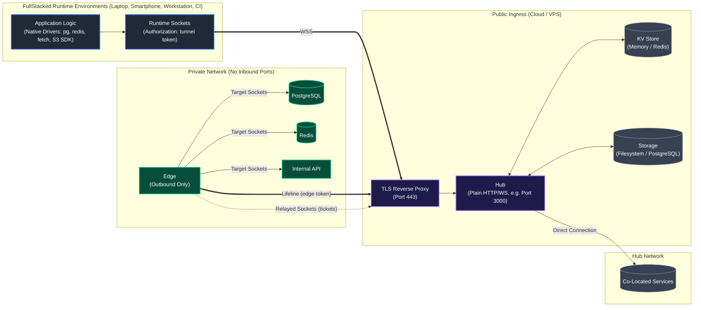
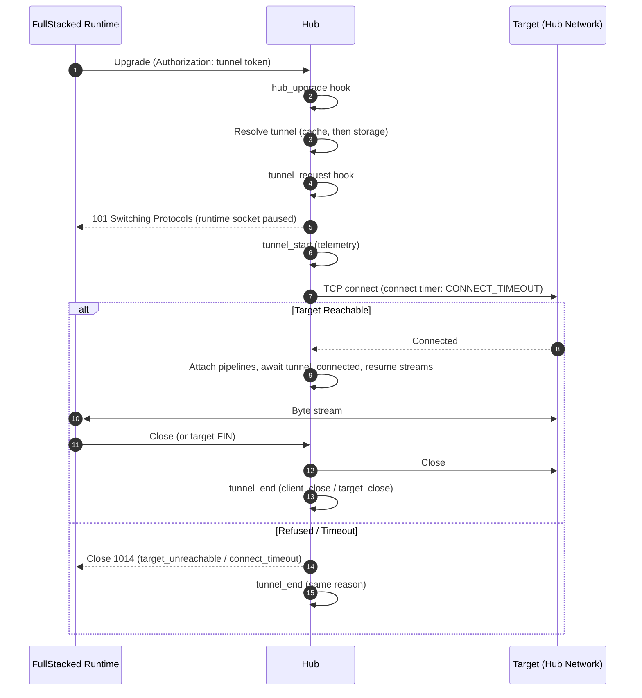
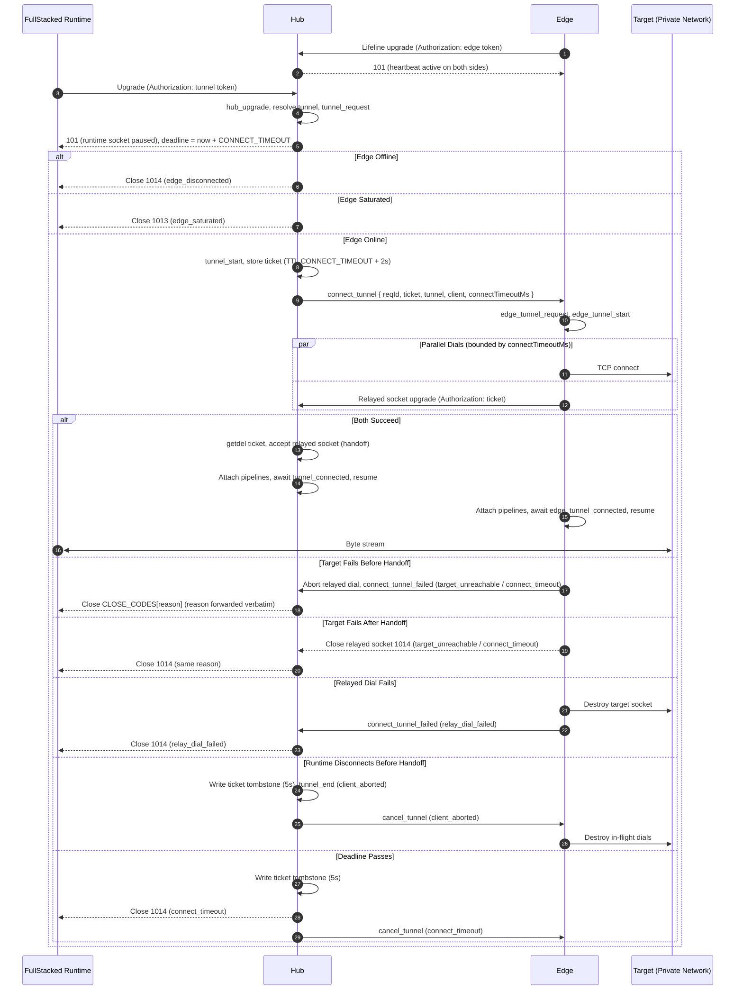

# System Architecture & Topology

## Roles

Terms used below are defined in the [Glossary](glossary.md).

1. **Hub**: the public server. It terminates runtime sockets, resolves tokens, performs direct connections to services it can reach itself, hosts Edge lifelines, and bridges relayed connections. It speaks plain HTTP/WS; TLS is terminated by a reverse proxy in front of it (see [Configuration](../2-nodes/configuration.md#deployment-requirement-tls)).
2. **Edge**: an outbound-only daemon inside a private network. It keeps one lifeline to the Hub and, per order, dials a target and opens a relayed socket back to the Hub.
3. **FullStacked runtime**: `tunnel.register({ host, authorization })` registers a virtual route in the runtime's network resolver and returns a virtual host. `host` is the Hub's address as `host:port`; `authorization` is the tunnel token. Every driver connection to the virtual host opens its own runtime socket to the Hub, so connection pools work unchanged. The port the driver uses on the virtual host is not sent to the Hub: the target is always the tunnel's `internalHost:internalPort`.

A **direct connection** is used when the tunnel has no `edgeId`; a **relayed connection** when it does.

---

## Direct Connection Sequence

---

## Relayed Connection Sequence

All failure reasons and close codes are defined in the [Protocol Spec](protocol-spec.md#close-reason-taxonomy). Timers are defined in [Connection Establishment Budget](protocol-spec.md#connection-establishment-budget).

---

## Trust Boundaries

- **Out of the box, nothing is authenticated beyond token possession.** Anyone who can reach the REST API can create tunnels, including direct tunnels to any host the Hub can reach. This is deliberate for tinkering; production deployments add security through [hooks](../4-extensibility/extending-security.md).
- **Tokens are bearer secrets.** Possessing a tunnel token grants access to its target; possessing an edge token lets a daemon impersonate that Edge.
- **The Edge trusts the Hub.** It dials whatever target an order names; restrict this with an `edge_tunnel_request` hook if the Hub is not fully trusted.
- **TLS is provided by the reverse proxy**, never by the Hub itself.
