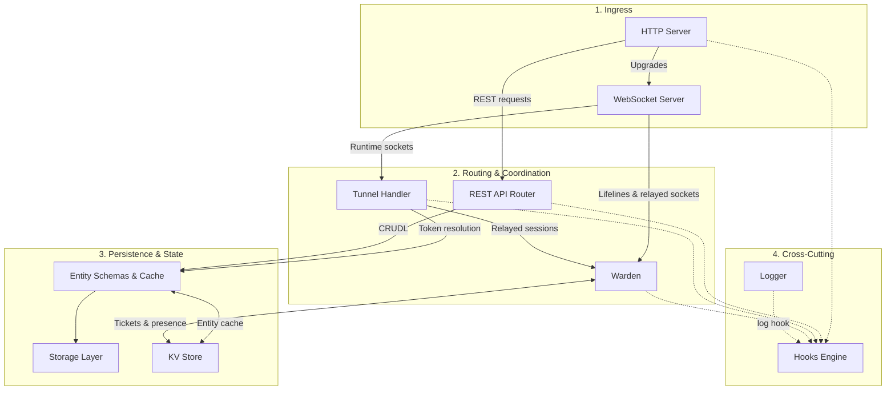

# Internals & Component Architecture

## Runtime Profiles

|                        | Default profile                    | Clustered profile                                                                                           |
| :--------------------- | :--------------------------------- | :---------------------------------------------------------------------------------------------------------- |
| Processes              | One (`WORKERS = 1`)                | Primary + `WORKERS` workers on **one host**                                                                 |
| Storage                | Filesystem (`DATA_DIR/store.json`) | PostgreSQL (required)                                                                                       |
| KV                     | In-memory                          | Redis (required)                                                                                            |
| Relayed socket routing | In-process                         | Socket migration through the Primary (see [Warden](../3-subsystems/warden.md#3-clustered-socket-migration)) |

Other valid combinations and the startup validation are listed in [Configuration](../2-nodes/configuration.md#valid-dependency-combinations). For fast tests of clustered behavior, `ALLOW_FILESYSTEM_MULTIWORKER` runs the clustered profile with file-backed storage and KV shared through `DATA_DIR` instead of PostgreSQL and Redis; it logs a warning on every start and is not for production (see [Test Mode](../2-nodes/configuration.md#test-mode-multi-worker-without-postgresql-or-redis)). The Edge never needs storage or KV.

## Component Index

| Component                                               | Responsibility                                                                                          |
| :------------------------------------------------------ | :------------------------------------------------------------------------------------------------------ |
| [HTTP Server](../3-subsystems/http-server.md)           | Single listening port; routes REST requests and WebSocket upgrades; `req.deny()`; client IP resolution. |
| [WebSocket Server](../3-subsystems/websocket-server.md) | Upgrade handshakes, duplex stream adapter, heartbeat sweep.                                             |
| [Tunnel Handler](../3-subsystems/tunnel-handlers.md)    | Runtime socket lifecycle: gating, direct dials, splicing, session registry, teardown.                   |
| [Warden](../3-subsystems/warden.md)                     | Lifelines, presence, tickets, orders, saturation, cross-worker socket migration.                        |
| [REST API Router](../3-subsystems/rest-api-router.md)   | CRUDL for `/tunnels` and `/edges`, token rolling, custom routes.                                        |
| [Entity Schemas](../3-subsystems/entity-schemas.md)     | `Edge` / `Tunnel` models, validation, token generation, entity cache.                                   |
| [Storage Layer](../3-subsystems/storage-layer.md)       | `StorageProvider` (filesystem, PostgreSQL).                                                             |
| [KV Store](../3-subsystems/key-value-store.md)          | `KVProvider` (memory, Redis) and the key registry.                                                      |
| [Logger](../3-subsystems/logger.md)                     | Leveled text/JSON logs, breadcrumb ring buffer, `log` hook.                                             |
| [Hooks](../4-extensibility/hooks.md)                    | Extension points, execution model, plugin loading.                                                      |
