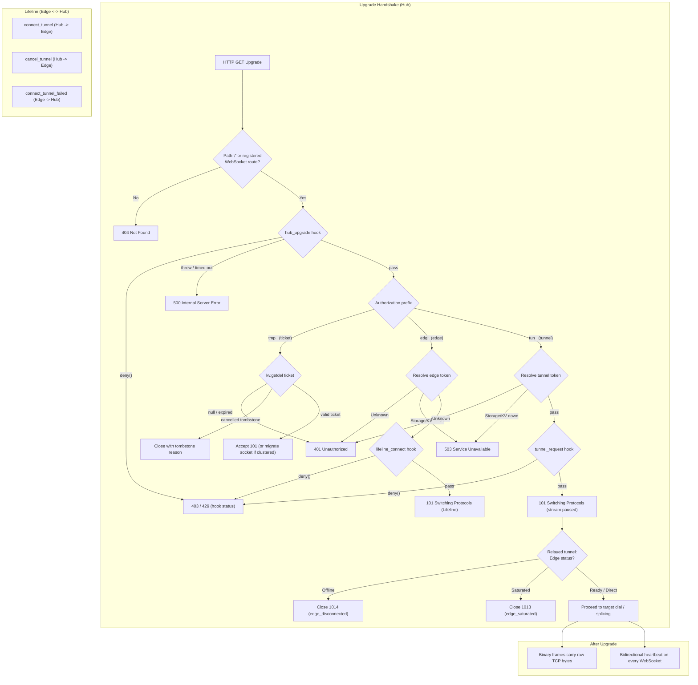

# Wire Protocol Specification



This document is the normative reference for everything that crosses a network boundary: upgrade handshakes, heartbeats, lifeline orders, data framing, timeouts, rejection statuses, close codes, and close reasons. Terms are defined in the [Glossary](glossary.md).

---

## 1. Upgrade Handshake

All WebSocket connections (runtime sockets, lifelines, relayed sockets) are HTTP/1.1 upgrades on the root path `/`:

```http
GET / HTTP/1.1
Host: tunnels.example.com
Upgrade: websocket
Connection: Upgrade
Sec-WebSocket-Key: dGhlIHNhbXBsZSBub25jZQ==
Sec-WebSocket-Version: 13
Authorization: tun_4f8a9e2d1c3b...
x-request-id: 7d0c6c1e-2f55-4a8e-9b61-0a3d1f2e4b5c
version: 0.1.0
```

| Header | Required | Description |
| :--- | :--- | :--- |
| `Authorization` | Yes | The raw token, with no scheme prefix: a tunnel token (`tun_...`), edge token (`edg_...`), or ticket (`tmp_...`). The core does not strip `Bearer ` or any other prefix; a `hub_upgrade` hook may normalize the header before classification. |
| `x-request-id` | No | Client-supplied correlation id. Kept only as `correlationId` in logs and forwarded to Edges. It is never used as a key. The Hub always generates its own `reqId` (UUIDv4). |
| `version` | No | Informational semver of the connecting runtime or Edge. Recorded (for Edges, stored as `edge.version`) but never used to accept or reject a connection. The protocol is not versioned. |

The token prefix determines how the connection is handled: `tun_` = runtime socket, `edg_` = lifeline, `tmp_` = relayed socket.

### Rejection Statuses

Before `101 Switching Protocols`, the Hub rejects with an HTTP status and a JSON body (`Content-Type: application/json`, body produced with `JSON.stringify`):

| Status | Produced by | Scenario | Body |
| :--- | :--- | :--- | :--- |
| `401 Unauthorized` | Core only | `Authorization` missing, prefix unrecognized, or token does not resolve (unknown, rolled or deleted tunnel/edge token; missing, expired or invalid ticket). | `{"error":"Unauthorized"}` |
| `403 Forbidden` | Hooks (`req.deny()` default) | Valid credential refused by policy. | `{"error":"Denied"}` |
| `404 Not Found` | Core | Non-root path without a registered WebSocket route. | `{"error":"Not Found"}` |
| `429 Too Many Requests` | Hooks (`req.deny(429, ...)`) | Rate limited. The hook may set `Retry-After` (seconds). | `{"error":"Too Many Requests"}` |
| `500 Internal Server Error` | Core | A gating hook threw or exceeded `HOOK_TIMEOUT` (fail-closed). | `{"error":"Internal Server Error"}` |
| `503 Service Unavailable` | Core | Storage or KV unavailable while resolving the token. The core never reports this case as `401`. | `{"error":"Service Unavailable"}` |

Edge liveness (`edge_disconnected`) and saturation (`edge_saturated`) are signaled after `101 Switching Protocols` via WebSocket close frames (`1014` and `1013` respectively), ensuring uniform behavior across single-process and clustered deployments.

### Client Retry Policy

Only `401` means "this credential is not valid". Every other rejection is transient.

| Status | Edge lifeline | Relayed socket (ticket) |
| :--- | :--- | :--- |
| `401` | Enter the [revoked state](../2-nodes/edge.md#revocation-handling). | Abort that session only (`relay_dial_failed`). |
| `403` | Retry with backoff jumped to `MAX_RECONNECT_INTERVAL`. | Abort that session only. |
| `429` | Retry after `Retry-After` if present, else normal backoff. | Abort that session only. |
| `500`, `503`, network error, timeout | Retry with normal exponential backoff. | Abort that session only. |

A lifeline closed with code `1000` and reason `token_rolled` or `edge_deleted` is treated exactly like a `401`.

---

## 2. Lifeline Protocol

A lifeline carries WebSocket control frames (heartbeat ping/pong) and JSON text frames (opcode `0x1`) called orders. Every order has a `type` field. IPC messages between processes use the same `type` discriminator.

### A. `connect_tunnel` (Hub → Edge)

```json
{
  "type": "connect_tunnel",
  "reqId": "c8b4d8a1-5369-42b7-a3f2-1a7f4e912345",
  "ticket": "tmp_9f8a2b1c3d4e...",
  "tunnel": {
    "id": "e4b1b36e-7117-48f5-9cf2-4916a04874b3",
    "name": "postgres-prod",
    "internalHost": "127.0.0.1",
    "internalPort": 5432,
    "metadata": { "userId": "usr_9a8b7c6d" }
  },
  "client": {
    "ip": "203.0.113.1",
    "correlationId": "7d0c6c1e-2f55-4a8e-9b61-0a3d1f2e4b5c"
  },
  "connectTimeoutMs": 9985
}
```

| Field | Description |
| :--- | :--- |
| `reqId` | Hub-generated UUID for logs. |
| `ticket` | Single-use ticket the Edge presents on the relayed socket. All correlation (pending orders, cancellation, failures) is keyed by ticket. |
| `tunnel` | The target and metadata. Never includes the tunnel token or `edgeId`. |
| `client.ip` | The runtime's client IP as resolved by the Hub (see [Client IP](../3-subsystems/http-server.md#client-ip-resolution)). |
| `client.correlationId` | The runtime's `x-request-id`, if any. |
| `connectTimeoutMs` | **Required.** Milliseconds left before the deadline when the frame was written. Relative, so Hub/Edge clock skew is irrelevant. |

No other client headers are ever forwarded.

### B. `connect_tunnel_failed` (Edge → Hub)

Sent only **before handoff**:

```json
{
  "type": "connect_tunnel_failed",
  "reqId": "c8b4d8a1-5369-42b7-a3f2-1a7f4e912345",
  "ticket": "tmp_9f8a2b1c3d4e...",
  "reason": "target_unreachable"
}
```

| `reason` | Condition |
| :--- | :--- |
| `hook_denied` | `edge_tunnel_request` called `context.deny()`. |
| `hook_error` | `edge_tunnel_request` threw or exceeded `HOOK_TIMEOUT`. |
| `target_unreachable` | Target dial failed (`ECONNREFUSED`, `EHOSTUNREACH`, DNS failure). |
| `connect_timeout` | `connectTimeoutMs` expired before both dials completed. |
| `relay_dial_failed` | The relayed socket dial to the Hub failed or was rejected. |

On receipt the lifeline worker deletes the ticket from KV, clears the pending order, and fails the session with that reason, forwarded verbatim.

After handoff, the relayed socket is the channel: if the target dial then fails or the budget expires, the Edge closes the relayed socket with the matching close code and reason (`target_unreachable` or `connect_timeout`), and the Hub propagates that close code and reason to the runtime socket verbatim.

### C. `cancel_tunnel` (Hub → Edge)

```json
{ "type": "cancel_tunnel", "reqId": "c8b4d8a1-...", "ticket": "tmp_9f8a2b1c3d4e...", "reason": "client_aborted" }
```

Sent when a session is abandoned before handoff. `reason` is `client_aborted` (the runtime disconnected) or `connect_timeout` (the Hub's deadline passed). The Edge destroys both in-flight dials (`socket.destroy()`), discards the order, and emits `edge_tunnel_end(context, tunnel, reason)` with that reason.

### D. Relayed Failure Reason Sources

Every failed relayed session reaches the runtime and `tunnel_end` with exactly one reason:

| Observed by | Condition | Reason |
| :--- | :--- | :--- |
| Edge, before handoff | `connect_tunnel_failed` | The Edge's reason, verbatim. |
| Edge, after handoff | Relayed socket closed with an error code | The close reason, verbatim. |
| Hub | Deadline passed without handoff or failure frame | `connect_timeout` |
| Hub | Lifeline dropped while the order was pending | `edge_disconnected` |
| Hub | Lifeline worker exceeded `MAX_PENDING_ORDERS` / `MAX_LIFELINE_BUFFER` | `edge_saturated` |
| Hub (clustered) | Origin or lifeline worker died before handoff | `target_worker_dead` |
| Hub | Runtime disconnected before handoff | `client_aborted` (hooks only; no close frame can be sent) |

### E. Saturation

A pending order is acknowledged by handoff or by `connect_tunnel_failed` (there is no separate ack). The lifeline worker refuses to dispatch a new order when the Edge already has `MAX_PENDING_ORDERS` pending orders or the lifeline's `bufferedAmount` exceeds `MAX_LIFELINE_BUFFER`:

Across all modes (single-process and clustered), the Hub accepts the runtime upgrade (`101 Switching Protocols`), and the lifeline worker immediately terminates the session with close code `1013` and reason `edge_saturated`.

---

## 3. Heartbeat (All WebSocket Connections)

The bidirectional heartbeat runs on **every** WebSocket connection: lifelines, runtime sockets, and relayed sockets. It exists to keep each connection alive across all NATs, firewalls, reverse proxies, and load balancers on the path, and to detect dead peers.

* Both ends send a WebSocket `ping` every `HEARTBEAT_INTERVAL` (default 10s, shorter than the idle timeout of common proxies and load balancers) and answer every `ping` with a `pong`.
* Any frame received (pong, ping, text, or binary) refreshes the peer's `lastReceived` timestamp.
* A connection is dead when `now - lastReceived >= HEARTBEAT_TIMEOUT` (default 30s). It is terminated with code `1011` and reason `heartbeat_timeout`.
* `HEARTBEAT_INTERVAL` can be shortened for infrastructure with more aggressive idle timeouts, or lengthened to reduce control traffic. It must stay well below `HEARTBEAT_TIMEOUT`.
* Heartbeats are driven by one shared sweep timer per process that iterates over open connections; no timer is allocated per connection.
* Ping and pong are control frames: they never appear in the byte stream delivered to either end.
* Target sockets are plain TCP and never cross a WebSocket proxy; they use OS-level TCP keepalive (`socket.setKeepAlive(true, 60000)`).

On a lifeline, the Hub additionally records presence (see [Warden](../3-subsystems/warden.md#presence)). On the Edge, a dead lifeline triggers the reconnect loop.

---

## Connection Establishment Budget

A single deadline, owned by the Hub, bounds session setup. There are no per-stage ratios.

1. **Deadline**: when the Hub accepts a runtime upgrade it computes `deadline = now + CONNECT_TIMEOUT` (default 10s). In clustered mode the absolute `deadline` (epoch ms) travels in IPC messages; all workers share one host clock.
2. **Order**: when writing `connect_tunnel`, `connectTimeoutMs = deadline - now`. If this is not positive the order is not sent and the session fails with `connect_timeout`.
3. **Edge**: computes `edgeDeadline = receivedAt + connectTimeoutMs`, fires `edge_tunnel_start(context, tunnel)`, and dials the target and the Hub **in parallel**. Both dials must complete before `edgeDeadline`; when either fails, the other is destroyed.
4. **Hub wait**: the origin worker waits until handoff, a failure, or `deadline`. At `deadline` it fails the session with `connect_timeout`, marks the ticket as cancelled in KV (5s TTL tombstone), and sends `cancel_tunnel`.
5. **Ticket lifetime**: the KV ticket and the lifeline worker's pending order both expire at `CONNECT_TIMEOUT + 2s`. When cancelled or timed out early, a 5-second tombstone `{ status: "cancelled", reason }` prevents concurrent relayed connections from returning false `401 Unauthorized` / `relay_dial_failed` errors.
6. **Direct connections**: the Hub's target dial is bounded by a connect timer of `CONNECT_TIMEOUT` that is cleared on `connect`. `socket.setTimeout()` is never used for this, because it is an idle timeout that would later kill quiet, established sessions.

| Timer | Owner | Value |
| :--- | :--- | :--- |
| Wait for relayed handoff | Hub (origin worker) | until `deadline` |
| Target dial + relayed socket dial (parallel) | Edge | `connectTimeoutMs` |
| Direct target dial | Hub | `CONNECT_TIMEOUT`, cleared on connect |
| `relayed_request:<ticket>` KV TTL | Hub | `CONNECT_TIMEOUT + 2s` (tombstone 5s on cancel) |
| Pending order entry | Hub (lifeline worker) | `deadline + 2s` |

---

## 4. Data Framing

Once a session is established:

1. Payload bytes are carried in binary WebSocket frames (opcode `0x2`), verbatim, with no wrapping or inspection.
2. `permessage-deflate` is disabled on every WebSocket.
3. Node.js stream backpressure applies end to end: when a writable buffer is full, the corresponding readable is paused until `drain`.
4. The port a driver uses on the virtual host returned by `tunnel.register` is a runtime-side detail and is never sent to the Hub. The target is always `internalHost:internalPort` of the tunnel resolved from the token. `tunnel.register({ host })` itself takes the Hub's address as `host:port` (for example `tunnels.example.com:443`).

### Symmetrical Teardown (No Half-Close)

* When either side ends (FIN), errors, or closes, both sides are torn down. TCP half-close is not propagated.
* Clean termination sends close code `1000` with `client_close` or `target_close`; errors use the codes in [Close Codes](#5-close-codes).
* Teardown sends the close frame first and destroys underlying sockets upon receiving the WebSocket `'close'` event or stream `'finish'` event (with a 500 ms fallback safety timer). Hard errors (`stream_error`, `ECONNRESET`) destroy sockets immediately.

Protocols that work: PostgreSQL, MySQL/MariaDB, Redis, MongoDB, HTTP/1.1 (including keep-alive), HTTP/2 and gRPC, and interactive SSH sessions. Protocols that do **not** work: any client that half-closes its write side (`shutdown(SHUT_WR)`) and then waits for a reply on the read side, for example some HTTP/1.0 clients or `nc -N`-style request/response pipes.

---

## 5. Close Codes

| Code | Name | Reasons |
| :--- | :--- | :--- |
| `1000` | Normal Closure | `client_close`, `target_close`, `token_rolled`, `tunnel_deleted`, `tunnel_updated`, `edge_deleted`, `superseded`, `client_aborted` (internal) |
| `1001` | Going Away | `hub_shutdown`, `edge_shutdown` |
| `1008` | Policy Violation | `hook_denied` |
| `1011` | Internal Error | `hook_error`, `stream_error`, `target_worker_dead`, `heartbeat_timeout` |
| `1013` | Try Again Later | `edge_saturated` |
| `1014` | Bad Gateway | `target_unreachable`, `connect_timeout`, `relay_dial_failed`, `edge_disconnected` |

## Close Reason Taxonomy

Only these strings are ever sent in close frames or reported as the primary taxonomy reason in `tunnel_end`, `edge_tunnel_end`, and `lifeline_disconnect`. There are no dynamic messages across the wire (details go to logs), so every reason fits the 123-byte limit of RFC 6455 §5.5 without truncation. For internal telemetry hooks (`tunnel_end` and `edge_tunnel_end`), the underlying Node.js `Error` instance (if any) is passed as an optional fourth parameter (`error?: Error`) for logging and diagnostic inspection.

| Reason | Applies to | Meaning |
| :--- | :--- | :--- |
| `client_close` | Session | The runtime ended the stream cleanly. |
| `target_close` | Session | The target ended the stream cleanly (FIN). |
| `client_aborted` | Session | The runtime disconnected before handoff. |
| `target_unreachable` | Session | Target dial refused / host unreachable / DNS failure. |
| `connect_timeout` | Session | The deadline passed before the session was established. |
| `relay_dial_failed` | Session | The Edge could not open or had rejected its relayed socket. |
| `edge_disconnected` | Session | The Edge's lifeline dropped while the order was pending. |
| `edge_saturated` | Session | The Edge's lifeline exceeded its pending-order or buffer limit. |
| `target_worker_dead` | Session | A Hub worker involved in the session died before handoff. |
| `hook_denied` | Session | A gating hook on the Edge denied the order. |
| `hook_error` | Session | A gating hook on the Edge threw or timed out. |
| `stream_error` | Session | Network error during active streaming (`ECONNRESET`, `EPIPE`, ...). |
| `heartbeat_timeout` | Any WebSocket | Nothing received from the peer for `HEARTBEAT_TIMEOUT`. |
| `token_rolled` | Session, lifeline | The tunnel or edge token was rolled; access is revoked immediately. |
| `tunnel_deleted` | Session | The tunnel was deleted. |
| `tunnel_updated` | Session | The tunnel's `internalHost`, `internalPort`, or `edgeId` changed. |
| `edge_deleted` | Session, lifeline | The Edge was deleted. |
| `superseded` | Lifeline | A newer lifeline for the same Edge replaced this one. |
| `hub_shutdown` | Any WebSocket | The Hub is shutting down. |
| `edge_shutdown` | Relayed socket, lifeline | The Edge daemon is shutting down. |
