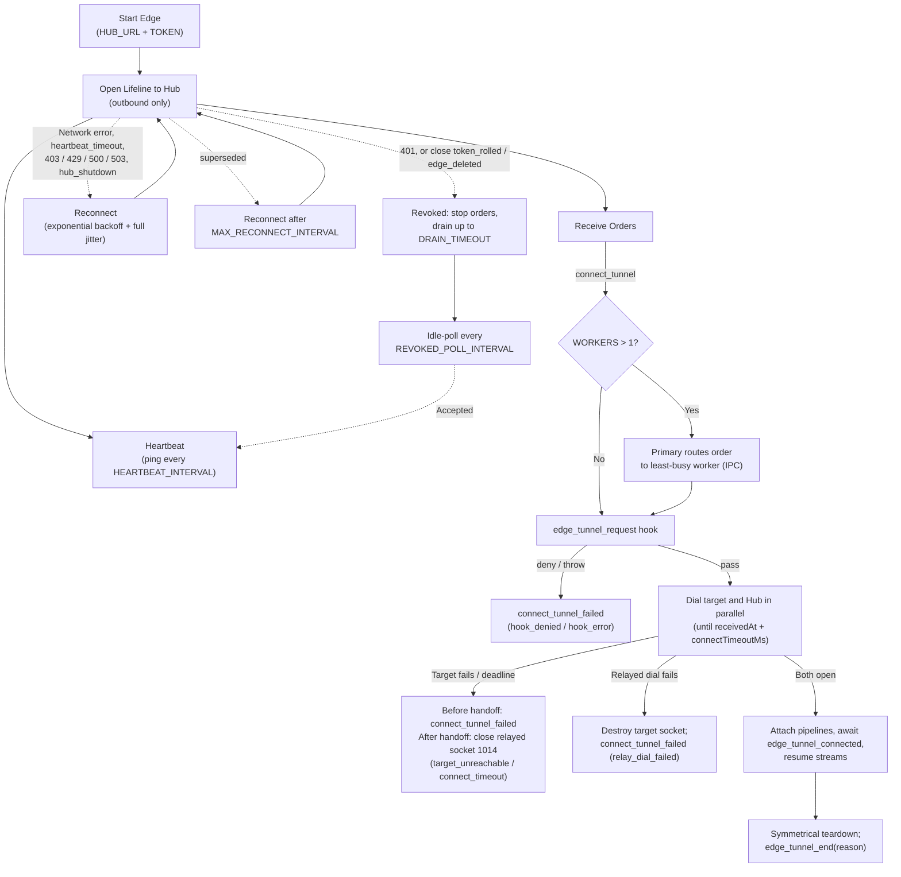

# Edge



## Role

The Edge is selected when `HUB_URL` is set. It runs inside a private network, never listens on any port, and only makes outbound connections to the Hub (typically `wss://` on 443 through the Hub's TLS proxy). It has no storage or KV dependencies. All settings are in the [Configuration Reference](configuration.md#edge-settings).

```bash
# Single process
node server/src/main.ts --hub-url wss://tunnels.example.com --token edg_a1c2e3d4...

# Multi-worker
HUB_URL="wss://tunnels.example.com" TOKEN="edg_a1c2e3d4..." WORKERS=4 node server/src/main.ts
```

Run exactly one daemon per edge token. A second daemon with the same token replaces the first (`superseded`), and the two keep replacing each other.

---

## Lifeline

### Heartbeat

The Edge runs the [bidirectional heartbeat](../1-concepts/protocol-spec.md#3-heartbeat-all-websocket-connections) on its lifeline and on every relayed socket. A lifeline that receives nothing for `HEARTBEAT_TIMEOUT` is terminated (`heartbeat_timeout`) and the Edge reconnects.

### Reconnection

Reconnect delays follow `min(MAX_RECONNECT_INTERVAL, RECONNECT_INTERVAL * 2^attempt)` with full jitter (uniform between 0 and that value). The Edge also enters this loop when the Hub is unreachable at startup. The attempt counter resets once a lifeline has stayed up for one `HEARTBEAT_INTERVAL`.

How each lifeline outcome is handled follows the [Client Retry Policy](../1-concepts/protocol-spec.md#client-retry-policy):

| Outcome | Behavior |
| :--- | :--- |
| Network error, timeout, `500`, `503`, `heartbeat_timeout`, close `hub_shutdown` | Normal backoff. |
| `429` | Wait `Retry-After` if present, otherwise normal backoff. |
| `403` | Backoff jumps to `MAX_RECONNECT_INTERVAL`. |
| Close `superseded` | Log a warning (another daemon or a newer connection uses this token) and reconnect after `MAX_RECONNECT_INTERVAL`. |
| `401`, close `token_rolled` / `edge_deleted` | Enter the revoked state. |

### Revocation Handling

In the revoked state the Edge:

1. Logs `Edge token revoked` at `warn` (repeated on every poll).
2. Stops accepting orders.
3. Lets in-flight sessions finish for up to `DRAIN_TIMEOUT` (default 30s), then force-closes the rest. When revocation comes from a token roll or deletion, the Hub also closes those sessions itself (`token_rolled` / `edge_deleted`), so draining is only a safety net.
4. Stays alive and retries the lifeline every `REVOKED_POLL_INTERVAL` (default 300s).
   * **With `TOKEN_FILE`**: the Edge re-reads the token from the file on disk before each poll attempt. In Kubernetes/Docker secrets environments, updating the secret file allows the daemon to automatically recover without restarting the pod or container!
   * **With static `TOKEN`**: the poll acts as a quiescent keep-alive so container supervisors (e.g. `restart: always`) do not enter aggressive restart crash loops. Restart the daemon with the new token to resume.

A `401` on a relayed socket (expired or already-claimed ticket) only aborts that session (`relay_dial_failed`); it never affects the lifeline.

### Orders

The order formats (`connect_tunnel`, `cancel_tunnel`, `connect_tunnel_failed`) are defined in the [Protocol Spec](../1-concepts/protocol-spec.md#2-lifeline-protocol). The Edge has no timeout setting of its own; every order carries `connectTimeoutMs`.

---

## Session Setup and Splicing

For each `connect_tunnel` order:

1. **Gate**: run `edge_tunnel_request(context, tunnel)`. `context.deny()` fails the order with `hook_denied`; a throw or `HOOK_TIMEOUT` fails it with `hook_error`. Either way, `connect_tunnel_failed` is sent, no socket is opened, and neither `edge_tunnel_start` nor `edge_tunnel_end` fires.
2. **Start & Parallel dials**: dispatch `edge_tunnel_start(context, tunnel)`. Compute `edgeDeadline = receivedAt + connectTimeoutMs` and start both dials: the target socket to `internalHost:internalPort`, and the relayed socket to `HUB_URL` presenting `Authorization: <ticket>`. Each stream is paused as soon as it opens, so the target's greeting and any early runtime bytes are buffered until splicing.
3. **Target failure or deadline**: destroy the other dial. Before handoff, send `connect_tunnel_failed` with `target_unreachable` or `connect_timeout`. After handoff (the relayed socket was already accepted), close the relayed socket with `1014` and the same reason. `edge_tunnel_timeout` fires when the deadline was the cause.
4. **Relayed dial failure**: destroy the target socket and send `connect_tunnel_failed` with `relay_dial_failed`.
5. **Splice**: once both are open, attach two pipelines with backpressure, await `edge_tunnel_connected(context, tunnel, remoteSocket, targetSocket)` (bounded by `HOOK_TIMEOUT`), then resume both streams. Because the hook runs before `resume()`, byte-counting listeners see every byte.
6. **Teardown**: when either side ends or errors, close both (no half-close) and emit `edge_tunnel_end(context, tunnel, reason, error?)` exactly once.

```typescript
import { pipeline } from "node:stream";

let closed = false;
function teardown(reason: Reason, error?: Error) {
  if (closed) return;
  closed = true;
  const code = CLOSE_CODES[reason]; // mapping from the Protocol Spec close-code table
  
  if (relayedWs.readyState === relayedWs.OPEN) {
    relayedWs.close(code, reason);
    // Event-driven flush: wait for close event or destination finish with a 500ms safety timer
    const cleanup = () => {
      relayedDuplex.destroy(error);
      targetSocket.destroy(error);
    };
    const timer = setTimeout(cleanup, 500);
    relayedWs.once("close", () => { clearTimeout(timer); cleanup(); });
  } else {
    // Hard error or already closed: clean up immediately
    relayedDuplex.destroy(error);
    targetSocket.destroy(error);
  }
  
  dispatchTelemetry("edge_tunnel_end", context, tunnel, reason, error); // not awaited, includes Error if present
}

// Callback-form pipeline: (source, destination, callback). Each pipeline ends its destination on EOF,
// and teardown() then closes the other direction (no half-close).
pipeline(relayedDuplex, targetSocket, (err) => teardown(err ? "stream_error" : "client_close", err ?? undefined));
pipeline(targetSocket, relayedDuplex, (err) => teardown(err ? "stream_error" : "target_close", err ?? undefined));

await runAwaitedHook("edge_tunnel_connected", context, tunnel, relayedDuplex, targetSocket); // bounded by HOOK_TIMEOUT, fail-open

relayedDuplex.resume();
targetSocket.resume();
```

---

## Multi-Worker Mode

With `WORKERS > 1` the Edge runs a Primary and workers on one host:

* **Primary**: holds the single lifeline and the heartbeat. It tracks pending orders in `edgeOrders: Map<ticket, { workerId }>` and active sessions in `activeSessions: Map<ticket, workerId>`, routing each order to the least-busy worker.
* **Workers**: run `edge_tunnel_request`, perform the parallel dials, splice, and emit the `edge_tunnel_*` hooks.

IPC messages (all use the `type` discriminator, all keyed by `ticket`):

| `type` | Direction | Payload | Purpose |
| :--- | :--- | :--- | :--- |
| `connect_tunnel` | Primary → worker | `{ reqId, ticket, tunnel, client, deadline }` | `deadline = receivedAt + connectTimeoutMs` as absolute epoch ms (same host clock). |
| `cancel_tunnel` | Primary → worker | `{ ticket, reason }` | Abort in-flight dials. |
| `order_handoff` | worker → Primary | `{ ticket }` | Relayed socket accepted; Primary moves order from `edgeOrders` to `activeSessions`. |
| `connect_tunnel_failed` | worker → Primary | `{ reqId, ticket, reason }` | Primary forwards the frame on the lifeline and removes the pending order. |
| `session_ended` | worker → Primary | `{ ticket }` | Primary looks up `activeSessions`, decrements the worker's active count, and deletes the session. |

**Worker crash**: the Primary forks a replacement and, for each pending order owned by the dead worker (not yet `order_handoff`), sends `connect_tunnel_failed` with `relay_dial_failed`. Established sessions on that worker end when their sockets close; the Hub sees the relayed sockets drop and closes the runtime sockets with `stream_error`.

**Primary crash**: the whole daemon exits; restart it with a process supervisor.

---

## Shutdown

On `SIGINT` / `SIGTERM` the Edge closes its lifeline with `1001 edge_shutdown`, stops accepting orders, lets sessions finish for up to `SHUTDOWN_TIMEOUT`, closes any remaining relayed sockets with `1001 edge_shutdown`, and exits.

---

## Hooks

The Edge emits `edge_tunnel_request` (gating), `edge_tunnel_start`, `edge_tunnel_connected`, `edge_tunnel_timeout`, and `edge_tunnel_end` (telemetry). Signatures, failure policies, and where each runs are in the [Hooks Catalog](../4-extensibility/hooks.md). The Edge does not count bytes or track durations by default.
