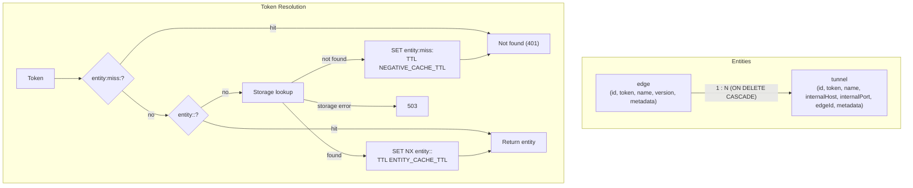

# Entity Schemas & Token Resolution



## Entities

Entities deliberately carry only routing data: no `createdAt`, `updatedAt`, or audit columns. Plugins can add audit data in `metadata` or in their own storage.

### Edge (`edge`)

```typescript
export interface Edge {
  id: string;                      // UUID, generated by the Hub
  token: string;                   // edg_..., generated by the Hub
  name: string;                    // descriptive label (1-128 chars)
  version: string | null;          // reported by the Edge on lifeline connect; read-only via REST
  metadata: Record<string, any>;   // free-form (tenancy, labels); default {}
}
```

REST responses add two computed fields, `connected: boolean` and `lastSeen: number | null` (unix seconds), derived from [presence](warden.md#presence).

| Column | Type | Constraints |
| :--- | :--- | :--- |
| `id` | `uuid` | Primary key |
| `token` | `text` | Not null, **unique** |
| `name` | `text` | Not null |
| `version` | `text` | Nullable |
| `metadata` | `jsonb` | Not null, default `{}` |

### Tunnel (`tunnel`)

```typescript
export interface Tunnel {
  id: string;                      // UUID, generated by the Hub
  token: string;                   // tun_..., generated by the Hub
  name: string;                    // descriptive label (1-128 chars)
  internalHost: string;            // target host
  internalPort: number;            // target port, 1-65535
  edgeId: string | null;           // null = direct connection from the Hub
  metadata: Record<string, any>;   // default {}
}
```

| Column | Type | Constraints |
| :--- | :--- | :--- |
| `id` | `uuid` | Primary key |
| `token` | `text` | Not null, **unique** |
| `name` | `text` | Not null |
| `internalHost` | `text` | Not null |
| `internalPort` | `integer` | Not null, 1-65535 |
| `edgeId` | `uuid` | Nullable, foreign key to `edge.id`, `ON DELETE CASCADE` |
| `metadata` | `jsonb` | Not null, default `{}` |

Field validation rules are listed once, in the [REST API](rest-api-router.md#validation). Names are purely descriptive labels; only `id` and `token` are unique.

## Tokens

* Format: prefix + 32 cryptographically random bytes, base64url-encoded. Prefixes: `tun_` (tunnel), `edg_` (edge), `tmp_` (ticket, see [Warden](warden.md#2-relayed-sessions)).
* Always generated by the Hub; clients can never supply or overwrite one. Rotation is done with the roll-token endpoints.
* All tokens are **bearer secrets**: whoever holds one has the access it grants. They are stored and returned as plain text (tinkerer convenience); treat API responses, the filesystem store, and database backups as sensitive.

## Token Resolution & Cache

Handshakes resolve tokens through the KV store to avoid a storage query per connection (see the flowchart above):

| Key | Value | TTL |
| :--- | :--- | :--- |
| `entity:tunnel:<token>` / `entity:edge:<token>` | Full entity | `ENTITY_CACHE_TTL` (default 60s) |
| `entity:miss:<token>` | `1` | `NEGATIVE_CACHE_TTL` (default 5s) |

* Positive entries are written with `SET NX` on read-through and updated directly on mutation.
* Negative entries stop repeated invalid tokens from reaching storage on every attempt.
* If storage or KV is unavailable, resolution fails with `503`, never `401`.

### Invalidation Order (Write-Through)

Every mutation follows the same deterministic order:

1. Commit the change in storage.
2. Update the cache:
   * For updates: write the updated entity directly to KV (`kv.set("entity:<table>:<token>", entity, ENTITY_CACHE_TTL)`).
   * For token rolls: write the new entity to KV, delete the old cache key, and write `entity:miss:<oldToken>` with `NEGATIVE_CACHE_TTL`.
   * For deletions: delete `entity:<table>:<token>` and write `entity:miss:<token>`.
3. Sever affected sessions (see [Session Registry](tunnel-handlers.md#session-registry)).

Because mutations write-through directly to KV with negative tombstones for revoked tokens, cache consistency is immediate and deterministic without relying on delayed deletion timers. Existing sessions never depend on the cache: step 3 closes them.

## Hooks

REST operations on these entities emit `scope_<table>`, `create_<table>`, `update_<table>`, `delete_<table>`, `roll_token_<table>`, and the corresponding `*_done` hooks. They are documented once, in the [Hooks Catalog](../4-extensibility/hooks.md), and their order in each operation in the [REST API](rest-api-router.md#operation-pipelines).
