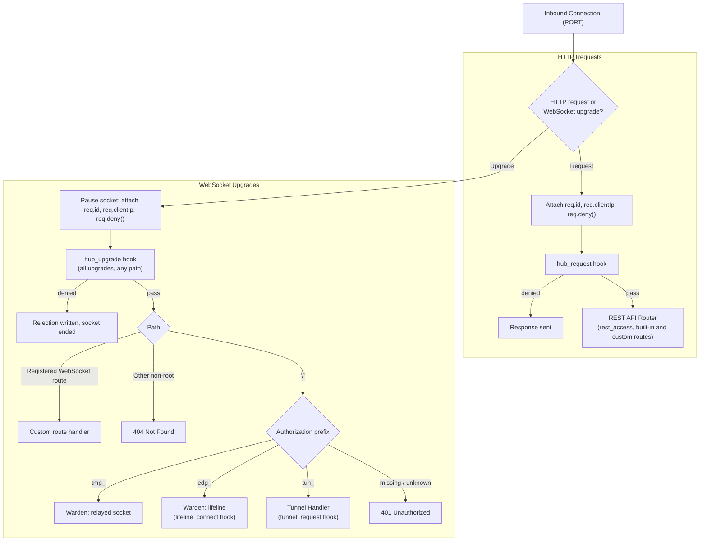

# HTTP Server & Ingress Routing

## Overview

One TCP port (`PORT`, default 3000) serves both the REST API and all WebSocket upgrades. The Hub speaks plain HTTP; TLS is terminated by a reverse proxy (see [Configuration](../2-nodes/configuration.md#deployment-requirement-tls)).

## Request Routing

### HTTP Requests

1. Attach `req.id` (Hub-generated UUID), `req.clientIp`, and `req.deny()`.
2. Run the `hub_request` gating hook. If the request was denied, stop.
3. Hand over to the [REST API Router](rest-api-router.md), which runs `rest_access` and matches routes (custom routes registered with `registerRoute` taking precedence when `{ prepend: true }` is passed) and built-in routes. Unmatched paths return `404`.

### WebSocket Upgrades

1. Pause the socket so no bytes are consumed before the handshake is complete.
2. Attach `req.id`, `req.clientIp`, and `req.deny()`.
3. Run the `hub_upgrade` gating hook. It runs for **every** upgrade, on any path, before any token resolution. It may inspect or rewrite `req.headers.authorization` (the core never strips prefixes such as `Bearer `), apply global limits, or deny.
4. Route by path:
   * a path registered with `registerWebSocketRoute` goes to that handler;
   * any other non-root path is rejected with `404`;
   * the root path `/` is classified by the `Authorization` prefix.
5. Classify by prefix (no storage access needed for the classification itself):
   * `tmp_`: relayed socket, handled by the [Warden](warden.md#2-relayed-sessions). Claimed via KV ticket `getdel`; if cancelled tombstone, closed with cancellation reason.
   * `edg_`: lifeline. The edge is resolved, `lifeline_connect` runs, then the [Warden](warden.md#1-lifelines) accepts it.
   * `tun_`: runtime socket. The tunnel is resolved, `tunnel_request` runs, and the upgrade is accepted with `101`. If the target Edge is offline or saturated, it is immediately closed with `1014 edge_disconnected` or `1013 edge_saturated`.
   * missing or unknown prefix, or a token that does not resolve: `401 Unauthorized`. If resolution fails because storage or KV is unavailable: `503 Service Unavailable`.

All rejection statuses and their meaning for clients are defined in [Rejection Statuses](../1-concepts/protocol-spec.md#rejection-statuses).

---

## `req.deny(statusCode = 403, reason = "Denied", options?: { headers?: Record<string, string>; fields?: Record<string, string> })`

Every request and upgrade gets a `deny` function:

* **HTTP requests**: sends `statusCode` with `Content-Type: application/json` and body `JSON.stringify({ error: reason, fields })`, then ends the response.
* **Upgrades**: Node provides no response object before the handshake, so `deny` writes the raw response to the socket (`HTTP/1.1 <status> <standard status text>`, `Content-Type: application/json`, `Connection: close`, `Content-Length`, then the JSON body built with `JSON.stringify`) and ends the socket.
* **Headers & Fields**: hooks may pass extra headers and structured validation error fields, e.g. `req.deny(429, "Too Many Requests", { headers: { "Retry-After": "30" } })` or `req.deny(400, "Validation Error", { fields: { "internalPort": "must be > 1024" } })`.
* **Short-circuit**: `deny` sets the dedicated flag `req.denied = true`; the core checks this flag (never Node's own `req.destroyed`) after each hook and stops processing.

Status codes carry meaning for clients: hooks use `403` (policy, the default) or `429` (rate limit). `401` is reserved for the core; do not use it in hooks, because Edges treat `401` as a revoked credential.

**Fail-closed**: if a gating hook (`hub_request`, `hub_upgrade`, `rest_access`, `tunnel_request`, `lifeline_connect`, `scope_*`, and the pre-mutation hooks) throws or exceeds `HOOK_TIMEOUT`, the core logs the error and responds `500 Internal Server Error`. A crashed hook is reported as a server fault, not a policy decision, so clients retry. See [Hooks](../4-extensibility/hooks.md#execution-model).

---

## Client IP Resolution

`req.clientIp` is computed once per request:

1. Start from the socket's remote address.
2. If that address is inside one of the `TRUSTED_PROXIES` CIDRs, walk `X-Forwarded-For` from right to left, skipping addresses that are themselves trusted proxies; the first untrusted address is the client IP.
3. Normalize IPv4-mapped IPv6 addresses (`::ffff:203.0.113.1` becomes `203.0.113.1`).

Without `TRUSTED_PROXIES`, `X-Forwarded-For` is ignored. `req.clientIp` is what hooks should use for allowlists and rate limits, and what is forwarded to Edges as `client.ip`.

---

## Custom Routes

`registerRoute` (HTTP) and `registerWebSocketRoute` (upgrades on non-root paths) are documented in the [REST API Router](rest-api-router.md#custom-routes). Custom WebSocket routes run after `hub_upgrade`, like every other upgrade.
