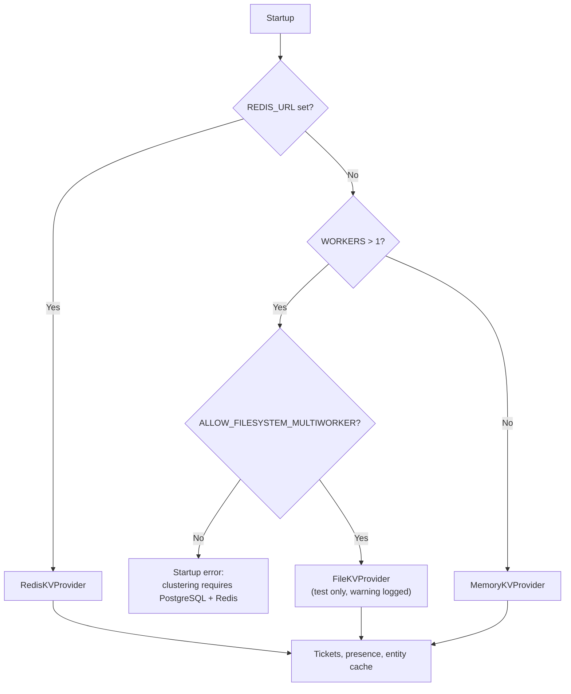

# Key-Value Store



## Overview

The KV store holds short-lived coordination data: tickets, Edge presence, and the entity cache. The Hub uses an in-memory provider in single-process mode (no disk I/O) and Redis when `REDIS_URL` is set, which is required when `WORKERS > 1`. For multi-worker tests without Redis, a file-backed provider can be enabled explicitly (see [`FileKVProvider`](#filekvprovider-test-only)). The Edge never uses a KV store.

## `KVProvider`

```typescript
export interface KVProvider {
    get<T = any>(key: string): Promise<T | null>;
    /** ttlSeconds omitted = no expiry. */
    set(key: string, value: any, ttlSeconds?: number): Promise<void>;
    /** Sets only if the key does not exist. Returns true if written. */
    setNX(key: string, value: any, ttlSeconds: number): Promise<boolean>;
    /** Deletes one or more keys. An empty array is a no-op. */
    del(keys: string | string[]): Promise<void>;
    /** Atomically reads and deletes. */
    getdel<T = any>(key: string): Promise<T | null>;
    /** Atomically deletes the key only if its value equals expected. */
    delIfEquals(key: string, expected: any): Promise<boolean>;
    sadd(key: string, member: string): Promise<void>;
    srem(key: string, member: string): Promise<void>;
    smembers(key: string): Promise<string[]>;
    close(): Promise<void>;
}
```

All methods are mandatory in every provider.

## Key Registry

| Key                                            | Owner        | Value                                                                                            | TTL                                                                  | Purpose                                                                                                                                             |
| :--------------------------------------------- | :----------- | :----------------------------------------------------------------------------------------------- | :------------------------------------------------------------------- | :-------------------------------------------------------------------------------------------------------------------------------------------------- |
| `relayed_request:<ticket>`                     | Warden       | `{ originWorker, lifelineWorker, edgeId, reqId, tunnelId }` or `{ status: "cancelled", reason }` | `CONNECT_TIMEOUT + 2s` (active ticket) or `5s` (cancelled tombstone) | Ticket. Claimed only with `getdel`. If cancelled, dial terminates cleanly with the recorded reason. See [Warden](warden.md#relayed-socket-arrival). |
| `edge:<edgeId>:worker`                         | Warden       | Worker identity `<bootId>:<workerId>`                                                            | `2 * HEARTBEAT_TIMEOUT` (60s)                                        | Which worker holds the lifeline. Refreshed once per sweep; removed with `delIfEquals`. See [Presence](warden.md#presence).                          |
| `edge:<edgeId>:last_seen`                      | Warden       | Unix seconds                                                                                     | 30 days rolling TTL                                                  | Last frame received on the lifeline. Refreshed on activity; auto-pruned after 30 days of inactivity.                                                |
| `worker:<bootId>:<workerId>:edges`             | Warden       | Set of edge ids                                                                                  | none (deleted when the worker exits or via primary IPC sweep)        | Reverse index for cleanup after a worker crash. Maintained with `sadd` / `srem`.                                                                    |
| `entity:tunnel:<token>`, `entity:edge:<token>` | Entity cache | Entity JSON                                                                                      | `ENTITY_CACHE_TTL`                                                   | Token resolution cache, populated on read or write-through. See [Entity Schemas](entity-schemas.md#invalidation-order-write-through).               |
| `entity:miss:<token>`                          | Entity cache | `1`                                                                                              | `NEGATIVE_CACHE_TTL` (5s)                                            | Negative cache tombstone for unknown or revoked tokens.                                                                                             |

Keys are namespaced by their first segment (`relayed_request`, `edge`, `worker`, `entity`), so entity-cache keys can never collide with presence keys.

## Providers

### `MemoryKVProvider`

- Used when `REDIS_URL` is not set (single process only).
- A `Map` plus one expiry sweep timer; no disk I/O.
- `getdel`, `setNX`, and `delIfEquals` are atomic by construction (single-threaded).

### `RedisKVProvider`

- Used when `REDIS_URL` is set; mandatory when `WORKERS > 1`.
- `set` with `EX`, `setNX` with `SET NX EX`, native `GETDEL`, multi-key `DEL`, `SADD` / `SREM` / `SMEMBERS`, and a Lua script for `delIfEquals`:
    ```lua
    if redis.call("get", KEYS[1]) == ARGV[1] then return redis.call("del", KEYS[1]) else return 0 end
    ```
    `delIfEquals` compares raw string values (such as worker identities `<bootId>:<workerId>`). If non-string values are provided, they are serialized to JSON before comparison across all providers.
- `close()` calls `quit()`.

### `FileKVProvider` (Test Only)

- Used when `WORKERS > 1`, `REDIS_URL` is not set, and `ALLOW_FILESYSTEM_MULTIWORKER` is enabled (see [Test Mode](../2-nodes/configuration.md#test-mode-multi-worker-without-postgresql-or-redis), including the startup warning).
- All processes (Primary and workers) share `DATA_DIR/kv.json`: `{ "entries": { "<key>": { "value": ..., "expiresAt": <epoch ms or null> } }, "sets": { "<key>": ["<member>", ...] } }`.
- Every operation is a read-modify-write under an exclusive cross-process lock, `DATA_DIR/kv.lock` (created with `O_CREAT | O_EXCL`; a lock older than 5 seconds is broken), and the file is replaced with a temporary-file-and-rename step before the lock is released.
- Because every operation runs under the lock, `getdel`, `setNX`, `delIfEquals`, and the set operations are atomic across processes, with the same semantics as Redis.
- Expired entries are treated as missing on read and pruned on the next write.
- Throughput is limited by the global lock and disk I/O; it is not intended for production.

## Failure Behavior

If the KV store is unreachable:

- Token resolution fails with `503` (never `401`), so Edges retry instead of entering their revoked state.
- Ticket creation fails, and the runtime socket is closed with `1011 stream_error`.
- Presence cannot be refreshed. Once `edge:<id>:worker` expires (`2 * HEARTBEAT_TIMEOUT`), other workers consider affected Edges offline (closing new runtime sessions with `1014 edge_disconnected`) until writes succeed again; the lifelines themselves stay open.
