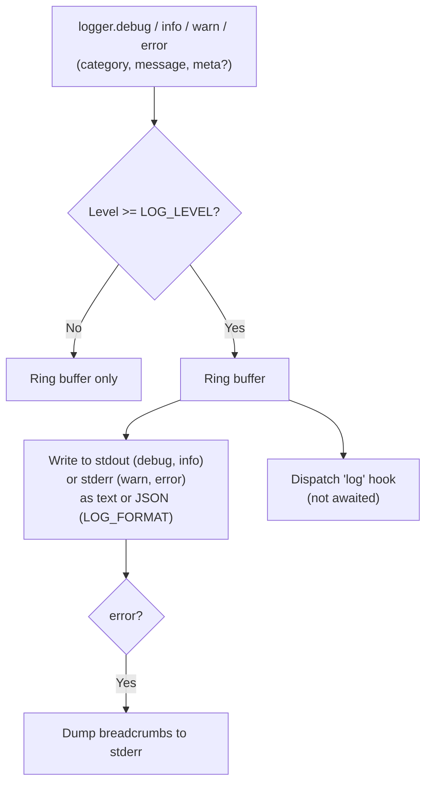

# Logger



## Overview

The logger writes leveled output, keeps a ring buffer of recent entries for post-mortem context, and dispatches every emitted entry to the `log` hook so plugins can ship logs elsewhere. It runs in the Primary and in every worker.

## API

```typescript
logger.debug(category: string, message: string, meta?: Record<string, any>): void;
logger.info(category: string, message: string, meta?: Record<string, any>): void;
logger.warn(category: string, message: string, meta?: Record<string, any>): void;
logger.error(category: string, message: string, meta?: Record<string, any> & { error?: unknown }): void;
```

All four methods share one signature. Pass a caught error as `meta.error`; it is serialized with its stack.

## Levels and Output

| Level   | Stream | Typical content                                                   |
| :------ | :----- | :---------------------------------------------------------------- |
| `debug` | stdout | Socket-level details.                                             |
| `info`  | stdout | Connections, sessions, registrations.                             |
| `warn`  | stderr | Recoverable anomalies: retries, heartbeat timeouts, revoked Edge. |
| `error` | stderr | Unexpected failures; triggers a breadcrumb dump.                  |

Entries below `LOG_LEVEL` (default `info`) are not written or dispatched to the `log` hook, but are still kept in the ring buffer. `-q` / `QUIET` is shorthand for `LOG_LEVEL=warn`.

Formats (`LOG_FORMAT`):

- `text`: `[2026-09-23T20:14:58.120Z] [INFO] [Tunnel] Session started {"reqId":"..."}`
- `json`: one `LogEntry` object per line: `{"timestamp":"...","level":"info","category":"Tunnel","message":"Session started","meta":{"reqId":"..."},"worker":"<bootId>:2","reqId":"..."}`

Every entry includes the worker identity (`<bootId>:<workerId>` in a Hub worker or single-process Hub, `<bootId>:primary` in the Hub Primary), and the `reqId` when it relates to a request.

## Breadcrumbs

The logger keeps the last 100 entries of all levels and categories in a ring buffer (per process). On `logger.error`, it dumps the buffer to stderr before the error, oldest first, giving the context that led to the failure. `logger.getBreadcrumbs()` returns a copy of the buffer.

## `log` Hook

```typescript
registerHook("log", (_req: null, entry: LogEntry) => {
    // e.g. forward entry to a log collector
});

interface LogEntry {
    timestamp: string;
    level: "debug" | "info" | "warn" | "error";
    category: string;
    message: string;
    meta?: Record<string, any>; // meta.error is serialized as { name, message, stack }
    worker: string;
    reqId?: string; // copied from meta.reqId when present
}
```

The hook is a telemetry hook: dispatched without being awaited, fail-open. Calls to `logger.*` made from inside a `log` hook are written to the output but not dispatched to the hook again (re-entrancy guard), so they cannot loop.
