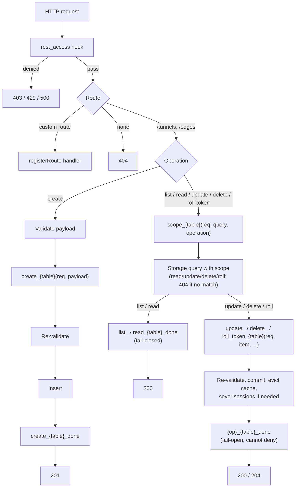

# REST API Router



## Overview

The REST API manages Edges and Tunnels. **It is open by default**: anyone who can reach the Hub's port can create, change, and delete tunnels, including direct tunnels to any host the Hub can reach. This keeps local tinkering frictionless. Production deployments add authentication and authorization with hooks; see [Extending Security](../4-extensibility/extending-security.md).

All endpoints accept and return `application/json`. Error bodies are always `{"error": "<message>"}` (plus `fields` for validation errors).

---

## Conventions

### Status Codes

| Status | When | Body |
| :--- | :--- | :--- |
| `200 OK` | Successful read, list, update, or token roll. | Entity or array |
| `201 Created` | Successful create. | Entity including generated `id` and `token` |
| `204 No Content` | Successful delete. | Empty |
| `400 Bad Request` | Malformed JSON, invalid field values, invalid UUID in the path, unknown `edgeId`, or a request that supplies `id`, `token`, or `version`. | `{"error": "...", "fields": {...}}` |
| `403 Forbidden` | Denied by a hook (`req.deny()`). | `{"error":"Denied"}` |
| `404 Not Found` | Unknown route, or no entity with that id **within the caller's scope**. | `{"error":"Not Found"}` |
| `429 Too Many Requests` | Rate limited by a hook. | `{"error":"Too Many Requests"}` |
| `500 Internal Server Error` | Unhandled error, or a gating/scope/post-query hook threw or timed out. | `{"error":"Internal Server Error"}` |
| `503 Service Unavailable` | Storage or KV unavailable. | `{"error":"Service Unavailable"}` |

### Validation

Payloads are validated before the pre-mutation hook and **re-validated after it**, so a hook cannot introduce invalid values or protected fields. A violation introduced by a hook is a hook bug and returns `500` (logged with the hook name).

| Field | Rule |
| :--- | :--- |
| `id`, `token` | Never accepted from clients (`400`). Generated by the Hub. |
| `version` (edge) | Read-only; set from the Edge's `version` header. |
| `name` | String, 1-128 characters. Descriptive label. Names do not need to be unique. |
| `internalHost` | Hostname, IPv4, or IPv6 literal. |
| `internalPort` | Integer 1-65535. |
| `edgeId` | `null` or the id of an existing edge (`400 {"error":"Invalid edge identifier"}` otherwise). |
| `metadata` | JSON object, at most 16 KB serialized. |

### Update Semantics

`PUT` and `PATCH` are aliases and perform a partial merge: omitted fields keep their stored values. `metadata` is merged key by key (`{ ...existing.metadata, ...updates.metadata }`); a key set to `null` is removed. Setting `metadata: null` resets it to `{}`. Setting `edgeId` to `null` turns a relayed tunnel into a direct one.

### Pagination, Sorting, Filtering

`GET /tunnels` and `GET /edges` accept:

| Parameter | Default | Description |
| :--- | :--- | :--- |
| `limit` | `100` | Maximum rows, capped at `1000`. |
| `offset` | `0` | Rows to skip. |
| `orderBy` | `id:asc` | `<column>:(asc\|desc)`. |
| any column or `metadata.<key>` | | Equality filter. Values are converted to the column's type (e.g. `internalPort=5432` becomes an integer); an unconvertible value returns `400`. |

The total number of matching rows (within scope) is returned in the `X-Total-Count` header.

---

## Operation Pipelines

Every request first passes `rest_access(req)` (global authentication), then the per-operation pipeline below. Hook signatures, failure policies, and the execution model are in the [Hooks Catalog](../4-extensibility/hooks.md).

| Operation | Pipeline |
| :--- | :--- |
| List | `scope_<table>(req, query, "list")` → storage list with `query` → `list_<table>_done(req, items)` → `200` |
| Read | `scope_<table>(req, query, "read")` → storage get by id with `query` (`404` if no match) → `read_<table>_done(req, item)` → `200` |
| Create | validate → `create_<table>(req, payload)` → re-validate → insert (within `storage.transaction`) → `create_<table>_done(req, item)` → `201` |
| Update | `scope_<table>(req, query, "update")` → within `storage.transaction`: get with `query` (`404`) → validate → `update_<table>(req, item, updates)` → re-validate → update → commit → write-through cache → sever sessions if target changed → `update_<table>_done(req, item)` → `200` |
| Delete | `scope_<table>(req, query, "delete")` → within `storage.transaction`: get with `query` (`404`) → `delete_<table>(req, item)` → delete → commit → evict cache & write tombstone → sever sessions → `delete_<table>_done(req, item)` → `204` |
| Roll token | `scope_<table>(req, query, "roll_token")` → within `storage.transaction`: get with `query` (`404`) → `roll_token_<table>(req, item)` → generate new token → update → commit → write-through new token & tombstone old token → sever sessions → `roll_token_<table>_done(req, item)` → `200` |

Key properties:

* **Scope before fetch**: `scope_<table>` runs before any storage read and adds conditions to `query.where` (e.g. `metadata.userId = <caller>`). Every single-entity fetch and mutation uses that scope, so an entity outside the caller's scope is indistinguishable from a missing one (`404`), with no hook having to remember to deny.
* **No mutation without passing every gate**: if any gating or scope hook denies, throws, or times out, no storage query or mutation runs.
* **Post-query hooks** (`list_*_done`, `read_*_done`) run before serialization, mutate the result in place, and are **fail-closed**: if one throws, the response is `500` with no data, so a failing redaction hook can never leak rows. They may call `req.deny()`.
* **Post-mutation hooks** (`create_*_done`, `update_*_done`, `delete_*_done`, `roll_token_*_done`) run after the commit, are awaited (bounded by `HOOK_TIMEOUT`), and are **fail-open**: an error is logged and the response still reports the committed change. They cannot deny.

---

## Tunnels (`/tunnels`)

| Method & Path | Body | Success |
| :--- | :--- | :--- |
| `GET /tunnels` | | `200` array |
| `POST /tunnels` | `{ name, internalHost, internalPort, edgeId?, metadata? }` | `201` tunnel |
| `GET /tunnels/:id` | | `200` tunnel |
| `PUT` / `PATCH /tunnels/:id` | Any mutable fields | `200` tunnel |
| `DELETE /tunnels/:id` | | `204` |
| `POST /tunnels/:id/roll-token` | Empty or `{}` | `200` tunnel with new token |

```json
{
  "id": "e4b1b36e-7117-48f5-9cf2-4916a04874b3",
  "token": "tun_4f8a9e2d1c3b...",
  "name": "postgres-prod",
  "internalHost": "127.0.0.1",
  "internalPort": 5432,
  "edgeId": "a1c2e3d4-...",
  "metadata": { "userId": "usr_9a8b7c6d" }
}
```

Revocation effects on active sessions (roll, delete, and changes to `internalHost`, `internalPort`, or `edgeId`) are listed in the [Session Registry](tunnel-handlers.md#session-registry).

## Edges (`/edges`)

| Method & Path | Body | Success |
| :--- | :--- | :--- |
| `GET /edges` | | `200` array |
| `POST /edges` | `{ name, metadata? }` | `201` edge |
| `GET /edges/:id` | | `200` edge |
| `PUT` / `PATCH /edges/:id` | `{ name?, metadata? }` | `200` edge |
| `DELETE /edges/:id` | | `204` |
| `POST /edges/:id/roll-token` | Empty or `{}` | `200` edge with new token |

```json
{
  "id": "a1c2e3d4-...",
  "token": "edg_a1c2e3d4...",
  "name": "office-gateway",
  "version": "0.1.0",
  "metadata": {},
  "connected": true,
  "lastSeen": 1790684601
}
```

`connected` and `lastSeen` are computed by the core from [presence](warden.md#presence) on every read and list; they are not stored columns.

### Edge Deletion (Cascade)

Deleting an Edge deletes all of its tunnels:

1. Scope and fetch the edge; run `delete_edge(req, edge)`.
2. Within one storage transaction: select the edge's tunnels, run `delete_tunnel(req, tunnel)` for each (any denial aborts the whole deletion with no change), delete the edge (tunnels cascade), commit.
3. After commit: evict the edge's and every child tunnel's cache entries and the edge's presence keys, close the lifeline (`edge_deleted`), and sever all their sessions (`edge_deleted`).
4. Fire `delete_tunnel_done` for each child, then `delete_edge_done`.

### Token Rolling

`POST /<entities>/:id/roll-token` generates a new token (32 random bytes, prefixed), stores it (the old token remains valid if the storage update fails), evicts the old token from the entity cache, and severs active access immediately:

* **Tunnel**: every active session of the tunnel is closed with `1000 token_rolled`. New attempts with the old token get `401`.
* **Edge**: the lifeline and all sessions relayed through it are closed with `1000 token_rolled`; the Edge enters its [revoked state](../2-nodes/edge.md#revocation-handling) until restarted with the new token.

Clients then reconnect with the new token: the runtime passes it as `authorization` to `tunnel.register`; the Edge is restarted with `TOKEN=<new token>`.

---

## Custom Routes

```typescript
import { registerRoute } from "../server/src/api/index.ts";
import { registerWebSocketRoute } from "../server/src/http/index.ts";

// HTTP route. Matches the exact path. Pass { prepend: true } to match before built-in routes.
registerRoute("/status", async (req, res) => {
  res.writeHead(200, { "Content-Type": "application/json" });
  res.end(JSON.stringify({ ok: true }));
  return true; // handled
});

// WebSocket route on a non-root path. Runs after the hub_upgrade hook.
registerWebSocketRoute("/ws/events", (req, socket, head) => {
  wss.handleUpgrade(req, socket, head, (ws) => ws.send(JSON.stringify({ hello: "world" })));
});
```

Custom HTTP routes are part of the REST router, so `rest_access` applies to them. A public route (e.g. a health check) must be allowed explicitly in the `rest_access` hook.
