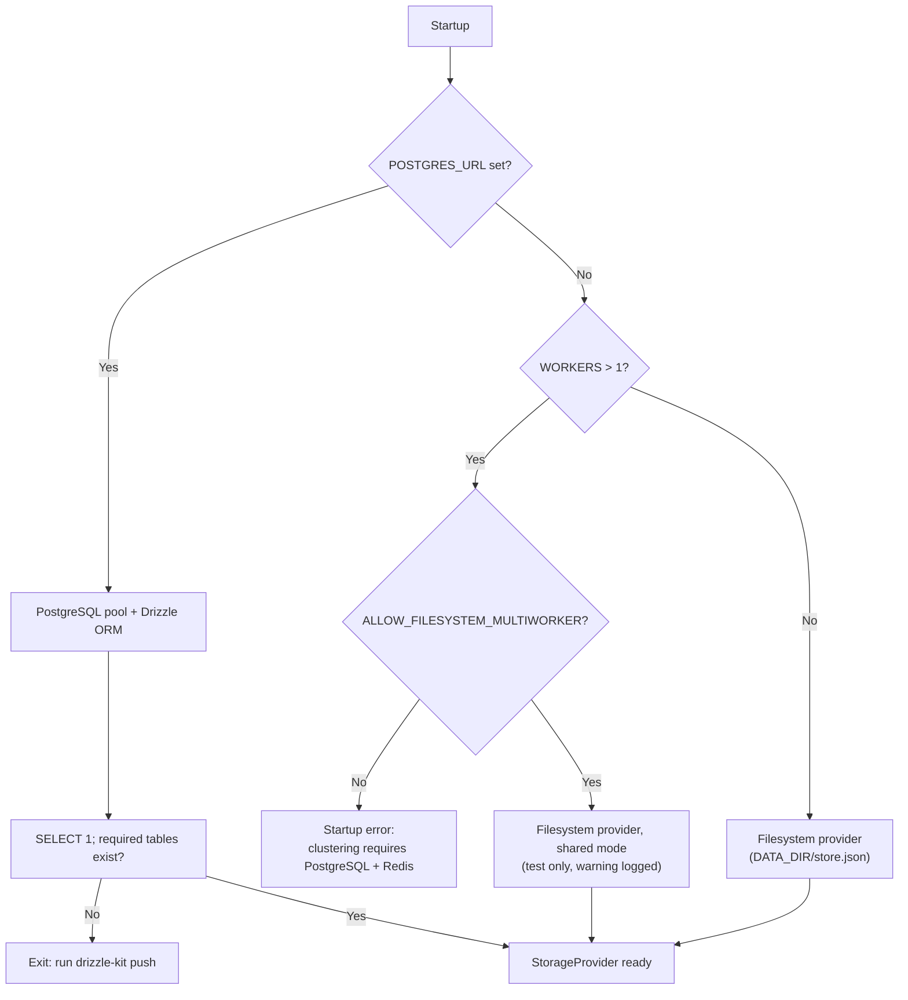

# Storage Layer



## Overview

The storage layer persists Edges and Tunnels behind one interface with two providers: a zero-dependency filesystem provider (default, single process; a shared mode exists for multi-worker tests) and PostgreSQL (required for production clustering). Valid combinations are listed in the [Configuration Reference](../2-nodes/configuration.md#valid-dependency-combinations).

## `StorageProvider`

```typescript
export type EntityName = "edge" | "tunnel";

export type Item = Record<string, any> & { id: string };

export type WhereOperator = "eq" | "neq" | "in" | "like";

export interface WhereCondition {
  column: string;          // a column name or "metadata.<key>"
  value: any;
  operator?: WhereOperator; // default "eq"
}

export interface QueryContext {
  where?: WhereCondition[];
  limit?: number;
  offset?: number;
  orderBy?: { column: string; direction: "asc" | "desc" };
}

export interface StorageProvider {
  list(entity: EntityName, query?: QueryContext): Promise<{ items: Item[]; total: number }>;
  find(entity: EntityName, where: WhereCondition[]): Promise<Item[]>;
  get(entity: EntityName, id: string, query?: QueryContext): Promise<Item | null>;
  getByToken(entity: EntityName, token: string): Promise<Item | null>;
  add(entity: EntityName, item: Omit<Item, "id">): Promise<Item>;
  update(entity: EntityName, id: string, changes: Partial<Item>, query?: QueryContext): Promise<Item | null>;
  remove(entity: EntityName, id: string, query?: QueryContext): Promise<Item | null>;
  /** Runs fn atomically: all changes are committed together or not at all. */
  transaction<T>(fn: (tx: StorageProvider) => Promise<T>): Promise<T>;
  /** Flushes pending writes and releases resources. */
  close(): Promise<void>;
}
```

`get`, `getByToken`, `update`, and `remove` return `null` when no row matches the lookup key **and** the optional `query` scope.

### Query Semantics (Identical in Both Providers)

| Operator | Meaning |
| :--- | :--- |
| `eq` | Equal. Values are converted to the column's type first (integers for `internalPort`, strings for text columns and `metadata.*`). |
| `neq` | Value is present and not equal. Rows where the column is `null` or missing never match. |
| `in` | `value` is an array; matches if the column equals any element. |
| `like` | Case-insensitive substring match. `%` and `_` in `value` are literal characters, not wildcards. |

`metadata.<key>` addresses a top-level key of `metadata` (PostgreSQL: `metadata->>'key'`, compared as text).

### Metadata Merge

On `update`, `changes.metadata` is merged key by key into the stored object; keys set to `null` are removed. Both providers implement this identically.

### Uniqueness

Both providers enforce unique `token` per entity and unique primary key `id`. Entity `name` attributes are non-unique descriptive labels for both Edges and Tunnels. A token collision surfaces as a conflict error that the REST API returns as `409 Conflict`.

---

## Filesystem Provider

* **Default** when `POSTGRES_URL` is not set. Single process, except in [shared mode](#shared-mode-test-only): without `ALLOW_FILESYSTEM_MULTIWORKER` the Hub refuses to start with `WORKERS > 1` and no PostgreSQL.
* **File**: all collections live in one file, `DATA_DIR/store.json` (`{ "edge": [...], "tunnel": [...] }`), so a change touching several collections (such as an edge cascade) is written in one atomic step (write to a temporary file, then rename).
* **Transactions**: `transaction()` applies changes to a copy of the in-memory state and swaps it in only if `fn` succeeds.
* **Performance**: reads are served from memory. Writes are coalesced and flushed at most every 5 seconds.
* **Durability trade-off**: an abrupt crash (SIGKILL, power loss) can lose up to the last 5 seconds of changes. Graceful shutdown flushes immediately via `close()`. Use PostgreSQL when every change must be durable.
* **Cascade**: removing an edge removes its tunnels in the same write.

### Shared Mode (Test Only)

Used when `WORKERS > 1`, `POSTGRES_URL` is not set, and `ALLOW_FILESYSTEM_MULTIWORKER` is enabled (see [Test Mode](../2-nodes/configuration.md#test-mode-multi-worker-without-postgresql-or-redis), including the startup warning). Every process opens the same `DATA_DIR/store.json`, so the provider switches from in-memory caching to strict read-through / write-through:

* **Cross-process lock**: every operation (read or write, including a whole `transaction()`) holds an exclusive lock, `DATA_DIR/store.lock`, created with `O_CREAT | O_EXCL` and removed afterwards. A lock older than 5 seconds is considered abandoned (crashed holder) and is broken.
* **Read-through**: under the lock, the file is reloaded if its modification time or size changed since the last read.
* **Write-through**: writes are flushed immediately (no 5-second coalescing) with the same temporary-file-and-rename step, before the lock is released.
* **Semantics**: identical to the default mode (queries, uniqueness, metadata merge, cascade, transactions), so tests exercise the same behavior as production storage.

## PostgreSQL Provider

* **Activated** by `POSTGRES_URL`. Required when `WORKERS > 1`, except in [test mode](../2-nodes/configuration.md#test-mode-multi-worker-without-postgresql-or-redis).
* **Engine**: `pg.Pool` with Drizzle ORM; `transaction()` maps to a database transaction.
* **Schema**: managed manually with Drizzle Kit (`npx drizzle-kit push --config server/drizzle.config.ts`). At startup the provider runs `SELECT 1` and checks that the `edge` and `tunnel` tables exist; otherwise the Hub exits with an error naming that command. See [Hub](../2-nodes/hub.md#schema-initialization).
* **Cascade**: `tunnel.edgeId` references `edge.id` with `ON DELETE CASCADE`.
* **Indexing for tenancy**: when scoping by a metadata key, add an expression index, e.g. `CREATE INDEX idx_tunnel_user ON tunnel ((metadata->>'userId'));`.
* **Shutdown**: `close()` ends the pool.

## Transaction & Cache Coordination

Storage providers execute mutations within atomic transactions via `storage.transaction(async tx => { ... })`. For operations modifying or deleting entities (`update`, `delete`, `roll_token`, and cascading edge deletion), changes are committed in the database before cache coordination takes place:

1. **Transaction Commit**: Mutation executes against PostgreSQL or the filesystem store atomically.
2. **Deterministic Write-Through**: The REST API writes updated entity data to KV cache (`entity:edge:<id>` or `entity:tunnel:<id>`) and sets negative cache tombstones (`entity:miss:<oldToken>` with 5s TTL) if tokens were rolled or entities removed, as defined in [Write-Through Caching](entity-schemas.md#write-through-caching).
