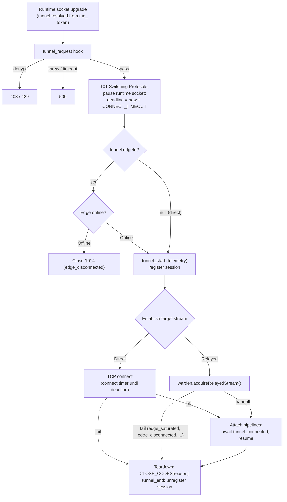

# Tunnel Handler



## Overview

The Tunnel Handler owns the lifecycle of every session that starts from a runtime socket: gating, the direct dial or the relayed request, splicing, revocation, and teardown. It does not count bytes or measure durations; that is left to [telemetry hooks](../4-extensibility/extending-monitoring.md).

## Session Lifecycle

1. **Gate**: `tunnel_request(req, tunnel)` runs before the upgrade. `req.deny()` rejects with the hook's status (default `403`); a throw or `HOOK_TIMEOUT` rejects with `500`.
2. **Accept**: `wss.handleUpgrade(req, socket, head, ...)` sends `101`. The `head` buffer is passed through so pipelined bytes are preserved. The runtime duplex is paused, so early driver bytes (e.g. a PostgreSQL `StartupMessage`) wait in its buffer. The deadline is set to `now + CONNECT_TIMEOUT`.
3. **Liveness** (relayed tunnels only): verified after `101` from [presence](warden.md#presence). If the Edge has no live lifeline, close immediately with `1014 edge_disconnected`; no session starts and no `tunnel_start` / `tunnel_end` fire.
4. **Start**: register the session (see [Session Registry](#session-registry)) and dispatch `tunnel_start(req, tunnel)`. From here on `tunnel_end` fires exactly once, whatever ends the session (failure, teardown, revocation, or shutdown).
5. **Target stream**:
    - **Direct**: `net.createConnection({ host: internalHost, port: internalPort })`, bounded by a plain timer that fires at the deadline, destroys the socket, and is cleared on `connect`. `socket.setTimeout()` is never used for this (it is an idle timeout). The target socket is paused on connect and uses TCP keepalive.
    - **Relayed**: `warden.acquireRelayedStream(tunnel, req, deadline)` resolves with the relayed duplex at handoff, or rejects with a taxonomy reason (see [Relayed Failure Reason Sources](../1-concepts/protocol-spec.md#d-relayed-failure-reason-sources)), including `edge_saturated` when the lifeline worker refuses the order.
    - If the runtime disconnects first, the session ends with `client_aborted`: a direct dial is destroyed; for relayed tunnels a 5s ticket tombstone is written to KV and the Warden sends `cancel_tunnel`.
    - If the session is severed (see [Session Registry](#session-registry)) or the Hub shuts down before the target stream is ready, the runtime socket is closed with that reason and the late target stream, if any, is destroyed.
6. **Splice**: attach both pipelines, await `tunnel_connected(req, tunnel, remoteSocket, targetSocket)` bounded by `HOOK_TIMEOUT`, then resume both streams. Hooks therefore observe every byte.
7. **Teardown**: the first side to end or fail determines the reason. The close code is resolved dynamically from `CLOSE_CODES[reason]` ([Protocol Spec](../1-concepts/protocol-spec.md#5-close-codes)). For relayed sessions, the reason the Edge put in the relayed socket's close frame is propagated verbatim when it is a taxonomy reason (e.g. `target_unreachable` after handoff); otherwise a clean end is `target_close`. A runtime close reason that is not a taxonomy reason is reported as `client_close`. If the session ended due to an error, the underlying `Error` instance is forwarded to the `tunnel_end` telemetry hook for rich diagnostics.

```typescript
import { pipeline } from "node:stream";

let closed = false;
function teardown(reason: Reason, error?: Error) {
    if (closed) return;
    closed = true;
    const code = CLOSE_CODES[reason]; // from the Protocol Spec close-code table

    if (runtimeWs.readyState === runtimeWs.OPEN) {
        runtimeWs.close(code, reason);
        // Event-driven flush: wait for close event or stream finish with a 500ms safety timer
        const cleanup = () => {
            runtimeDuplex.destroy(error);
            targetStream.destroy(error);
        };
        const timer = setTimeout(cleanup, 500);
        runtimeWs.once("close", () => {
            clearTimeout(timer);
            cleanup();
        });
    } else {
        // Hard error or already closed: clean up immediately
        runtimeDuplex.destroy(error);
        targetStream.destroy(error);
    }

    sessions.unregister(sessionId);
    dispatchTelemetry("tunnel_end", req, tunnel, reason, error); // not awaited, includes Error if present
}

pipeline(runtimeDuplex, targetStream, (err) =>
    teardown(err ? "stream_error" : "client_close", err ?? undefined)
);
pipeline(targetStream, runtimeDuplex, (err) =>
    teardown(err ? "stream_error" : "target_close", err ?? undefined)
);

await runAwaitedHook("tunnel_connected", req, tunnel, runtimeDuplex, targetStream); // bounded, fail-open

runtimeDuplex.resume();
targetStream.resume();
```

## Session Registry

Each worker keeps an in-memory index of its active sessions by `tunnelId` and by `edgeId`. It exists so that revocation takes effect immediately:

| Trigger                                                    | Sessions closed                        | Code / reason         |
| :--------------------------------------------------------- | :------------------------------------- | :-------------------- |
| Tunnel token rolled                                        | All sessions of that tunnel            | `1000 token_rolled`   |
| Tunnel deleted                                             | All sessions of that tunnel            | `1000 tunnel_deleted` |
| Tunnel `internalHost`, `internalPort`, or `edgeId` changed | All sessions of that tunnel            | `1000 tunnel_updated` |
| Edge token rolled                                          | All sessions relayed through that Edge | `1000 token_rolled`   |
| Edge deleted (tunnels cascade)                             | All sessions of its tunnels            | `1000 edge_deleted`   |

The REST API applies the change in storage first, evicts caches, and then broadcasts `sever_sessions { tunnelId | edgeId, reason }`. In clustered mode the broadcast goes through the Primary to every worker. Changes to `name` or `metadata` do not close sessions.

### Programmatic Session Severing API

In addition to REST-triggered mutations, the Hub exports a programmatic API allowing plugins, background subscribers, or custom event handlers (such as external revocation webhooks or message queue listeners) to immediately terminate active sessions matching a filter:

```typescript
/**
 * Programmatically severs active sessions across all workers matching the filter.
 * In clustered mode, broadcasts sever_sessions through the Primary to all workers.
 *
 * @param filter An object containing tunnelId, edgeId, or both.
 * @param reason The close taxonomy reason to report (default: "token_rolled").
 * @returns Total number of sessions severed.
 */
export async function severSessions(
    filter: { tunnelId?: string; edgeId?: string },
    reason: Reason = "token_rolled"
): Promise<number>;
```

Example usage in an external event subscriber or plugin:

```typescript
import { severSessions } from "../src/tunnels/registry.ts";

// Terminate all sessions for a specific tunnel immediately
const count = await severSessions({ tunnelId: "tun-uuid-1234" }, "token_rolled");
console.log(`Severed ${count} active session(s)`);
```

## Hooks

`tunnel_request`, `tunnel_start`, `tunnel_connected`, and `tunnel_end`. Signatures and policies are in the [Hooks Catalog](../4-extensibility/hooks.md).
