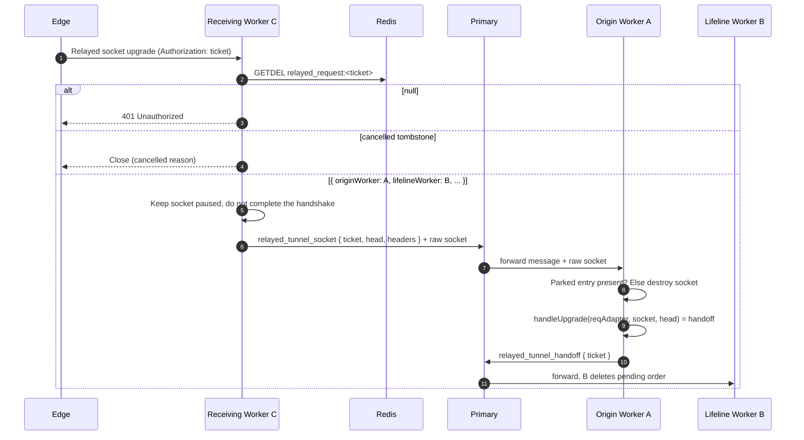

# Warden

```mermaid
flowchart TD
    subgraph L["1. Lifelines"]
        EdgeConn["Lifeline upgrade (edg_ token)"] --> Resolve["Resolve edge (cache / storage)"]
        Resolve --> Gate["lifeline_connect hook"]
        Gate --> Accept["101; replace any older lifeline (superseded)"]
        Accept --> Presence["Presence written to KV once per sweep"]
    end

    subgraph R["2. Relayed Sessions"]
        Req["acquireRelayedStream(tunnel, req, deadline)"] --> Ticket["Create ticket\n(KV TTL CONNECT_TIMEOUT + 2s)"]
        Ticket --> Where{"Lifeline on this worker?"}
        Where -->|"Yes"| Send["Check saturation;\nwrite connect_tunnel"]
        Where -->|"No"| IPC["IPC via Primary to lifeline worker"] --> Send
    end

    subgraph M["3. Relayed Socket Arrival"]
        Arrive["Relayed socket (tmp_ ticket)"] --> Claim["getdel relayed_request:<ticket>"]
        Claim -->|"null"| R401["401"]
        Claim -->|"ticket"| Same{"Origin worker?"}
        Same -->|"Yes"| Handoff["Upgrade; resolve relayed duplex (handoff)"]
        Same -->|"No"| Migrate["Migrate raw socket via Primary\nto origin worker"] --> Handoff
    end
```



## Overview

The Warden runs inside the Hub. It manages Edge lifelines and presence, issues tickets, sends orders, enforces saturation limits, and, in clustered mode, moves relayed sockets to the worker that holds the matching runtime socket. Terms are defined in the [Glossary](../1-concepts/glossary.md); wire formats in the [Protocol Spec](../1-concepts/protocol-spec.md#2-lifeline-protocol).

---

## 1. Lifelines

When an upgrade presents an edge token:

1. **Resolve**: look the edge up by token through the [entity cache](entity-schemas.md#token-resolution--cache). Unknown token: `401`. Storage or KV unavailable: `503`.
2. **Gate**: run `lifeline_connect(req, edge)`. `req.deny()` rejects with the hook's status (default `403`); a throw or `HOOK_TIMEOUT` rejects with `500`. Neither puts the Edge in its revoked state.
3. **Accept** the upgrade and add the lifeline to the heartbeat sweep.
4. **Newest wins**: if this Edge already has a lifeline (on this worker, or on another worker according to `edge:<id>:worker`), the older one is closed with `1000 superseded`. Pending orders sent on the older lifeline fail with `edge_disconnected`; the older lifeline's cleanup never unregisters the newer lifeline, its presence, or its pending orders. In clustered mode the new lifeline worker sends `close_lifeline { edgeId, reason: "superseded" }` to the old worker through the Primary.
5. **Version**: if the `version` header differs from `edge.version`, the stored value is updated (asynchronously). The field is informational and read-only through the REST API.
6. **Register**: `edgeLifelines.set(edge.id, ws)`, write presence immediately (below), and `SADD worker:<bootId>:<workerId>:edges <edgeId>`.

### Presence

Presence lets any worker, and `GET /edges`, know whether an Edge is online:

| Key                       | Value                                   | TTL                           | Written                                                                         |
| :------------------------ | :-------------------------------------- | :---------------------------- | :------------------------------------------------------------------------------ |
| `edge:<edgeId>:worker`    | Worker identity `<bootId>:<workerId>`   | `2 * HEARTBEAT_TIMEOUT` (60s) | On accept, then refreshed once per heartbeat sweep while the lifeline is alive. |
| `edge:<edgeId>:last_seen` | Unix seconds of the last frame received | 30 days (rolling)             | On accept, then once per heartbeat sweep.                                       |

Presence is written once per sweep per lifeline, never per pong, so KV load is one write pair per Edge per `HEARTBEAT_INTERVAL`.

An Edge is **online** when `edge:<id>:worker` exists and its `bootId` equals the current Hub's `bootId`. Because `bootId` changes on every Hub start, mappings left in Redis by a previous run are never mistaken for live lifelines.

### Heartbeat and Disconnect

The lifeline runs the [bidirectional heartbeat](../1-concepts/protocol-spec.md#3-heartbeat-all-websocket-connections). When a lifeline closes for any reason (heartbeat timeout, Edge disconnect, supersede, revocation, shutdown), the lifeline worker:

1. Removes it from `edgeLifelines` (only if it is still the registered lifeline for that Edge).
2. Unless a newer lifeline for the same Edge is registered on this worker, runs `delIfEquals("edge:<id>:worker", "<bootId>:<workerId>")`, so a newer lifeline registered elsewhere is never unregistered, and `SREM worker:<bootId>:<workerId>:edges <edgeId>`.
3. Fails every pending order sent on that lifeline with `edge_disconnected` (unless the close reason was `hub_shutdown`, which is used instead).
4. Dispatches `lifeline_disconnect(null, edge, reason)` with the lifeline's close reason. When the Hub closed the lifeline, this is the reason the Hub sent (`heartbeat_timeout`, `superseded`, `token_rolled`, `edge_deleted`, `hub_shutdown`), even if the Edge never answered the close handshake; when the Edge closed it, the Edge's reason if it is a taxonomy reason (e.g. `edge_shutdown`), otherwise `client_close`.

Established relayed sessions do not depend on the lifeline and keep running.

---

## 2. Relayed Sessions

`acquireRelayedStream(tunnel, req, deadline)` is called by the [Tunnel Handler](tunnel-handlers.md) after the runtime upgrade was accepted.

1. **Ticket**: generate `tmp_...`, then:
    ```typescript
    await kv.set(
        `relayed_request:${ticket}`,
        { originWorker, lifelineWorker, edgeId, reqId, tunnelId },
        CONNECT_TIMEOUT + 2 // the configured CONNECT_TIMEOUT, in seconds
    );
    relayedRequests.set(ticket, { resolve, reject, lifelineWorker, reqId, deadline });
    ```
2. **Dispatch**: if the lifeline is on this worker, handle it locally; otherwise send `relayed_tunnel_request` through the Primary to the lifeline worker.
3. **Lifeline worker**:
    - No lifeline for this Edge any more (stale presence): fail with `edge_disconnected`.
    - Pending orders `>= MAX_PENDING_ORDERS`, or `ws.bufferedAmount > MAX_LIFELINE_BUFFER`: fail with `edge_saturated`.
    - Otherwise record `pendingOrders.set(ticket, { originWorker, reqId, edgeId, expiresAt: deadline + 2000 })` and write `connect_tunnel` with `connectTimeoutMs = deadline - Date.now()` (not sent if not positive; fail with `connect_timeout`).
4. **Outcomes** (all delivered to the origin worker, which tears the session down with the given reason):
    - **Handoff**: see [Relayed Socket Arrival](#relayed-socket-arrival). The origin worker notifies the lifeline worker (`relayed_tunnel_handoff`), which deletes the pending order.
    - **`connect_tunnel_failed`**: the lifeline worker deletes the ticket (`kv.del`), deletes the pending order, and sends `relayed_tunnel_failed` with the Edge's reason, verbatim.
    - **Lifeline lost**: `edge_disconnected`.
    - **Runtime disconnects before handoff**: the origin worker writes a 5-second tombstone (`kv.set("relayed_request:<ticket>", { status: "cancelled", reason: "client_aborted" }, 5)`), deletes its parked entry, ends the session with `client_aborted`, and sends `relayed_tunnel_cancel { ticket, reason: "client_aborted" }` so the lifeline worker looks up `edgeLifelines.get(edgeId)` and writes `cancel_tunnel`.
    - **KV unavailable** while reading presence or creating the ticket: `stream_error`.
    - **Deadline**: the origin worker writes a 5-second tombstone (`kv.set("relayed_request:<ticket>", { status: "cancelled", reason: "connect_timeout" }, 5)`), deletes its parked entry, closes the runtime socket with `connect_timeout`, and sends `relayed_tunnel_cancel { ticket, reason: "connect_timeout" }`.

Pending orders are not given individual timers. Entries past `expiresAt` are ignored and removed by the heartbeat sweep; the sweep delay only affects memory reclamation, never client-visible timing.

### Relayed Socket Arrival

A relayed socket may arrive on any worker (the receiving worker):

1. **Claim**: always `getdel relayed_request:<ticket>` first, on every worker and in single-process mode. This is the only claim step, so a ticket can be used exactly once even if it is replayed concurrently to several workers.
    - `null`: `401 Unauthorized`.
    - `{ status: "cancelled", reason }`: close the incoming socket immediately with that reason (avoids false 401s on cancellations/timeouts).
2. **Local**: if the ticket's `originWorker` is this worker, look up `relayedRequests.get(ticket)`. If the entry is gone (the session already timed out or aborted), destroy the socket. Otherwise complete the upgrade, wrap it with `createWebSocketStream(ws, { allowHalfOpen: false })`, and resolve the parked promise: this is **handoff**.
3. **Remote**: otherwise migrate the raw socket to the origin worker (next section), which performs step 2.
4. After handoff, if the target dial on the Edge later fails, the Edge closes the relayed socket with `1014` and `target_unreachable` / `connect_timeout`; the Tunnel Handler propagates that close to the runtime socket.

---

## 3. Clustered Socket Migration

Node.js workers share no memory and cannot message each other directly; all IPC goes through the Primary. Relayed sockets arrive on arbitrary workers, so a socket must sometimes be moved to its origin worker. Socket migration requires plain TCP sockets, which is why TLS is always terminated by a reverse proxy in front of the Hub (see [Configuration](../2-nodes/configuration.md#deployment-requirement-tls)).



Migration details:

- The receiving worker neither completes the handshake nor reads further bytes; it forwards the request headers and the already-read `head` bytes with the socket.
- The Primary and workers use IPC `serialization: "advanced"`, so `head` arrives as a `Buffer`. The origin worker passes it as the third argument of `wss.handleUpgrade` and never calls `socket.unshift`.
- The origin worker builds a minimal `IncomingMessage`-compatible adapter (`method`, `url: "/"`, `headers`, `socket`) for `ws`.

### IPC Messages

All messages carry `type`, `target` (worker identity), and `ticket` where applicable.

| `type`                   | Route                               | Payload                                                             | Purpose                                                                                                                |
| :----------------------- | :---------------------------------- | :------------------------------------------------------------------ | :--------------------------------------------------------------------------------------------------------------------- |
| `relayed_tunnel_request` | origin → lifeline worker            | `{ ticket, reqId, edgeId, tunnel, client, deadline, originWorker }` | Ask the lifeline worker to send `connect_tunnel`. `deadline` is absolute epoch ms.                                     |
| `relayed_tunnel_cancel`  | origin or Primary → lifeline worker | `{ ticket, reason }`                                                | Look up `edgeId` in `pendingOrders`, send `cancel_tunnel` on that lifeline, and delete pending order.                  |
| `relayed_tunnel_failed`  | lifeline worker or Primary → origin | `{ ticket, reason }`                                                | Fail the session with `reason` (Edge reason verbatim, or `edge_disconnected`, `edge_saturated`, `target_worker_dead`). |
| `relayed_tunnel_socket`  | receiving → origin worker           | `{ ticket, head, headers }` + socket                                | Socket migration.                                                                                                      |
| `relayed_tunnel_handoff` | origin → lifeline worker            | `{ ticket }`                                                        | Delete the pending order.                                                                                              |
| `close_lifeline`         | any → lifeline worker               | `{ edgeId, reason }`                                                | Close a lifeline (`superseded`, `token_rolled`, `edge_deleted`).                                                       |
| `sever_sessions`         | any → all workers                   | `{ tunnelId?, edgeId?, reason }`                                    | Revocation broadcast (see [Session Registry](tunnel-handlers.md#session-registry)).                                    |

### Dead Workers

The Primary initializes the same KV provider as the workers (Redis, or the shared file KV in test mode) so that it can clean up after them.

When the Primary cannot deliver a message because the target worker is gone:

- A migrating socket is destroyed.
- If the origin worker died: Primary sends `relayed_tunnel_cancel { ticket, reason: "target_worker_dead" }` to the lifeline worker, which writes `cancel_tunnel` to the Edge and cleans up the pending order.
- If the lifeline worker died: Primary sends `relayed_tunnel_failed { ticket, reason: "target_worker_dead" }` to the origin worker, which closes the runtime socket.

When a worker exits, the Primary forks a replacement and cleans up that worker's presence:

```typescript
cluster.on("exit", async (worker) => {
    const identity = `${bootId}:${worker.id}`;
    const edgeIds = await kv.smembers(`worker:${identity}:edges`);
    for (const edgeId of edgeIds) {
        await kv.delIfEquals(`edge:${edgeId}:worker`, identity); // never removes a newer mapping
    }
    await kv.del(`worker:${identity}:edges`);
});
```

Sessions owned by the dead worker end when their sockets close. Edges whose lifelines were on it reconnect and land on another worker.

---

## Edge Token Roll and Deletion

1. The change is committed in storage, then the edge's cached entity and presence keys are evicted.
2. The lifeline is closed with `1000 token_rolled` or `1000 edge_deleted` (via `close_lifeline` in clustered mode); `lifeline_disconnect` fires.
3. All sessions relayed through that Edge are closed with the same reason (via `sever_sessions`).
4. The Edge enters its [revoked state](../2-nodes/edge.md#revocation-handling). Further attempts with the old token get `401`.

On Hub shutdown, every pending order on this worker's lifelines is cancelled (`cancel_tunnel` with `hub_shutdown`), parked relayed requests fail with `hub_shutdown`, and lifelines are closed with `1001 hub_shutdown`; Edges reconnect with backoff.

---

## Internal API

```typescript
/** Resolves with the relayed duplex at handoff; rejects with a taxonomy reason. */
export function acquireRelayedStream(
    tunnel: Tunnel,
    req: IncomingMessageWithDeny,
    deadline: number
): Promise<Duplex>;

/** Handles an upgrade presenting an edge token (after resolution). */
export function wardenLifeline(
    req: IncomingMessageWithDeny,
    socket: Duplex,
    head: Buffer,
    edge: Edge
): Promise<void>;

/** Handles an upgrade presenting a ticket. */
export function wardenRelayedSocket(
    req: IncomingMessageWithDeny,
    socket: Duplex,
    head: Buffer
): Promise<void>;
```

Settings used by the Warden (`CONNECT_TIMEOUT`, `HEARTBEAT_*`, `MAX_PENDING_ORDERS`, `MAX_LIFELINE_BUFFER`, `WORKERS`, `REDIS_URL`) are described in the [Configuration Reference](../2-nodes/configuration.md).
