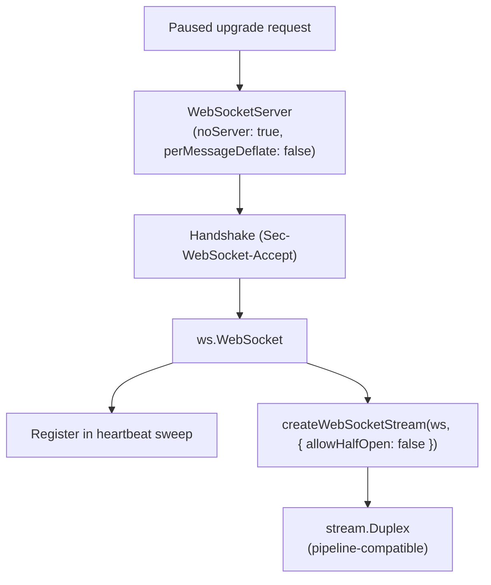

# WebSocket Server & Duplex Streams



## Overview

The WebSocket server has no listening port of its own. It completes upgrades handed over by the [HTTP Server](http-server.md), registers each connection in the heartbeat sweep, and exposes data connections (runtime sockets and relayed sockets) as Node.js `stream.Duplex` objects. Lifelines are used as message channels and are not wrapped in a duplex.

> [!NOTE]
> Standard browser WebSockets do not support custom request headers like `Authorization` under the [WHATWG WebSocket API specification](https://websockets.spec.whatwg.org/), so direct browser WebSockets cannot supply the `Authorization` header required by the Hub and are rejected with `401 Unauthorized`.
>
> Inside the **FullStacked runtime**, `window.WebSocket` is overridden by FullStacked's `WebSocketCore`. Calling `tunnel.register({ host, authorization, name? })` from `fullstacked/tunnel` returns the generated string (or custom `name`). When you create your WebSocket with that tunnel name (`new window.WebSocket("ws://" + tunnelName)`), FullStacked's `WebSocketCore` routes the connection through the registered tunnel with the specified `authorization` credentials.

## Configuration

- `noServer: true`: upgrades come from the HTTP server.
- `perMessageDeflate: false`: tunneled bytes are often already compressed or encrypted; compression would cost CPU and memory for no gain.
- `maxPayload`: bounded (default of the `ws` library) so a single frame cannot exhaust memory.

## Duplex Adapter

```typescript
import { createWebSocketStream } from "ws";

const duplex = createWebSocketStream(ws, { allowHalfOpen: false });
```

| Stream side           | WebSocket side        | Behavior                                                                             |
| :-------------------- | :-------------------- | :----------------------------------------------------------------------------------- |
| `duplex.write(chunk)` | binary frame          | Returns `false` when the socket buffer is full; writers wait for `drain`.            |
| `data` event          | binary frame received | Payload as `Buffer`.                                                                 |
| `duplex.end()`        | close handshake       | Used only through the teardown routine, which sends the close code and reason first. |
| `duplex.destroy()`    | socket destroyed      | Called after the close frame's flush window.                                         |

Because `allowHalfOpen` is `false`, the end of either direction ends both. Half-close is not supported (see [Symmetrical Teardown](../1-concepts/protocol-spec.md#symmetrical-teardown-no-half-close)).

## Heartbeat

Every WebSocket accepted or opened by a process (lifelines, runtime sockets, relayed sockets) is added to one shared sweep timer that runs the [bidirectional heartbeat](../1-concepts/protocol-spec.md#3-heartbeat-all-websocket-connections): it sends a `ping` every `HEARTBEAT_INTERVAL` and terminates connections that have received nothing for `HEARTBEAT_TIMEOUT` (`heartbeat_timeout`). No per-connection timers are allocated.

## Close Codes and Reasons

Close codes and the reason taxonomy are defined once, in the [Protocol Spec](../1-concepts/protocol-spec.md#5-close-codes). Only taxonomy strings are ever sent as close reasons, so the RFC 6455 limit of 123 bytes per reason is always respected without truncation.
