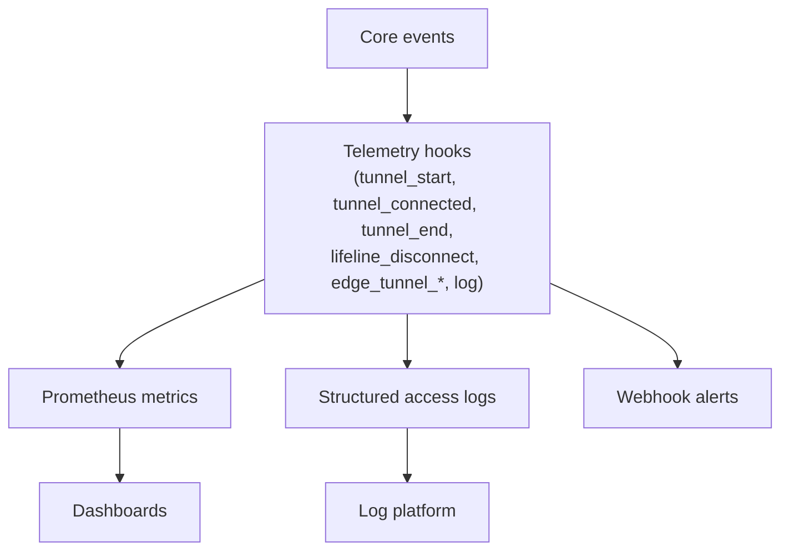

# Extending Monitoring



## Philosophy

The core does not count bytes, time sessions, or keep per-session objects. It emits telemetry hooks, and every metric is built by plugins on top of them. Telemetry hooks are not awaited on the data path and fail open (see [execution model](hooks.md#execution-model)), so monitoring code cannot slow down or break sessions. `tunnel_connected` is the exception: it is awaited before the streams resume, so listeners attached there see every byte.

Two guarantees make the recipes simple:

- On the Hub, `tunnel_start` is always followed by exactly one `tunnel_end`, so an active-session gauge is `start - end` with no underflow guard.
- On the Edge, `edge_tunnel_start` is always followed by exactly one `edge_tunnel_end`, providing the identical symmetric guarantee (`start - end`) for Edge active sessions without underflow. `edge_tunnel_connected` fires only for established sessions when streams are ready.

Plugin state is per process. With `WORKERS > 1`, a scrape of `/metrics` reaches only one worker, so keep counters in Redis (`INCRBY`) or push them to an external system instead of holding them in memory.

## Recipe 1: Prometheus Metrics

```typescript
import { registerHook } from "../server/src/utils/hooks.ts";
import { registerRoute } from "../server/src/api/index.ts";

let active = 0;
let completed = 0;
let bytesIn = 0; // runtime -> target
let bytesOut = 0; // target -> runtime
const endReasons = new Map<string, number>();

registerHook("tunnel_start", () => {
    active++;
});

registerHook("tunnel_connected", (_req, _tunnel, remoteSocket, targetSocket) => {
    remoteSocket.on("data", (chunk: Buffer) => {
        bytesIn += chunk.length;
    });
    targetSocket.on("data", (chunk: Buffer) => {
        bytesOut += chunk.length;
    });
});

registerHook("tunnel_end", (_req, _tunnel, reason) => {
    active--;
    completed++;
    endReasons.set(reason, (endReasons.get(reason) ?? 0) + 1);
});

registerRoute(
    "/metrics",
    (_req, res) => {
        const lines = [
            "# TYPE tunnels_active_sessions gauge",
            `tunnels_active_sessions ${active}`,
            "# TYPE tunnels_sessions_total counter",
            `tunnels_sessions_total ${completed}`,
            "# TYPE tunnels_bytes_in_total counter",
            `tunnels_bytes_in_total ${bytesIn}`,
            "# TYPE tunnels_bytes_out_total counter",
            `tunnels_bytes_out_total ${bytesOut}`,
            "# TYPE tunnels_session_end_total counter",
            ...[...endReasons].map(([r, n]) => `tunnels_session_end_total{reason="${r}"} ${n}`),
        ];
        res.writeHead(200, { "Content-Type": "text/plain; version=0.0.4" });
        res.end(lines.join("\n") + "\n");
        return true;
    },
    { prepend: true }
);
```

`/metrics` is a REST route, so `rest_access` applies; allow it explicitly if the API is protected (see [Extending Security](extending-security.md#recipe-1-admin-key-for-the-rest-api)).

## Recipe 2: Structured Access Log

```typescript
import { registerHook } from "../server/src/utils/hooks.ts";

const sessions = new Map<string, { startedAt: number; bytesIn: number; bytesOut: number }>();

registerHook("tunnel_start", (req) => {
    sessions.set(req.id, { startedAt: Date.now(), bytesIn: 0, bytesOut: 0 });
});

registerHook("tunnel_connected", (req, _tunnel, remoteSocket, targetSocket) => {
    const s = sessions.get(req.id)!;
    remoteSocket.on("data", (c: Buffer) => {
        s.bytesIn += c.length;
    });
    targetSocket.on("data", (c: Buffer) => {
        s.bytesOut += c.length;
    });
});

registerHook("tunnel_end", (req, tunnel, reason, error) => {
    const s = sessions.get(req.id)!;
    sessions.delete(req.id);
    process.stdout.write(
        JSON.stringify({
            event: "tunnel_access",
            timestamp: new Date().toISOString(),
            reqId: req.id,
            correlationId: req.correlationId,
            clientIp: req.clientIp,
            tunnel: {
                id: tunnel.id,
                name: tunnel.name,
                target: `${tunnel.internalHost}:${tunnel.internalPort}`,
            },
            durationMs: Date.now() - s.startedAt,
            bytesIn: s.bytesIn,
            bytesOut: s.bytesOut,
            reason,
            error: error ? { message: error.message, stack: error.stack } : undefined,
        }) + "\n"
    );
});
```

## Recipe 3: Webhook Alerts on Abnormal Endings

```typescript
import { registerHook } from "../server/src/utils/hooks.ts";

const WEBHOOK = process.env.ALERT_WEBHOOK_URL;
const NORMAL = new Set(["client_close", "target_close", "client_aborted", "hub_shutdown"]);

registerHook("tunnel_end", (_req, tunnel, reason, error) => {
    if (!WEBHOOK || NORMAL.has(reason)) return;
    fetch(WEBHOOK, {
        method: "POST",
        headers: { "Content-Type": "application/json" },
        body: JSON.stringify({
            text: `Tunnel ${tunnel.name} ended abnormally: ${reason}`,
            error: error ? { message: error.message, stack: error.stack } : undefined,
        }),
        signal: AbortSignal.timeout(5000),
    }).catch(() => {});
});

registerHook("lifeline_disconnect", (_req, edge, reason) => {
    if (!WEBHOOK || reason === "hub_shutdown") return;
    fetch(WEBHOOK, {
        method: "POST",
        headers: { "Content-Type": "application/json" },
        body: JSON.stringify({ text: `Edge ${edge.name} lifeline closed: ${reason}` }),
        signal: AbortSignal.timeout(5000),
    }).catch(() => {});
});
```

## Edge Metrics

The same pattern applies on the Edge with `edge_tunnel_request` (orders received and gating), `edge_tunnel_start` (active session tracking), `edge_tunnel_connected` (byte counting), and `edge_tunnel_end` (session completion and reason). See [examples/track-bandwidth-hook.ts](../../examples/track-bandwidth-hook.ts).

## Edge Presence

`GET /edges` already reports `connected` and `lastSeen` for every Edge; no hook is needed.
