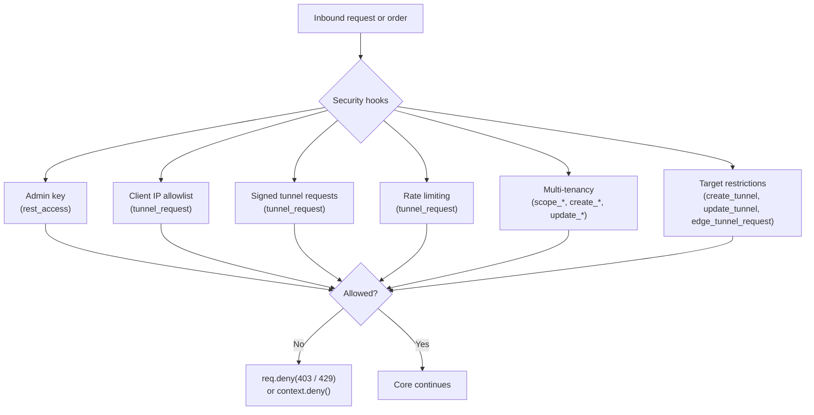

# Extending Security



## Philosophy

FullStacked Tunnels is **not secured out of the box**: the REST API needs no credentials and a tunnel token is all a client needs. That keeps tinkering frictionless on a laptop or Raspberry Pi. Before exposing a Hub beyond a trusted network, add the hooks below, and put a TLS proxy in front (see [Configuration](../2-nodes/configuration.md#deployment-requirement-tls)).

Two consequences of the open default to keep in mind:

- **Anyone who can reach the REST API can create tunnels**, including direct tunnels to any host the Hub can reach (its own `localhost`, other services on its network, cloud metadata endpoints). Recipes 1 and 6 address this.
- **Tokens are bearer secrets** and are returned by `GET` endpoints. Restrict who can call the API (Recipe 1) and who can see which rows (Recipe 5).

All gating hooks are fail-closed; see the [execution model](hooks.md#execution-model). Use `req.clientIp` (not `req.socket.remoteAddress`) for anything IP-based: it honors `TRUSTED_PROXIES` and normalizes IPv4-mapped addresses.

Plugins import from the server source tree; adjust the relative paths to where your plugin lives.

---

## Recipe 1: Admin Key for the REST API

```typescript
import crypto from "node:crypto";
import { registerHook } from "../src/utils/hooks.ts";

const ADMIN_TOKEN = process.env.ADMIN_TOKEN;
if (!ADMIN_TOKEN) throw new Error("ADMIN_TOKEN must be set"); // no fallback secret
const expected = Buffer.from(ADMIN_TOKEN);

const PUBLIC_PATHS = new Set(["/status"]);

registerHook("rest_access", (req) => {
    const path = (req.url ?? "/").split("?")[0];
    if (PUBLIC_PATHS.has(path)) return;

    const header = req.headers.authorization ?? "";
    const presented = Buffer.from(header.startsWith("Bearer ") ? header.slice(7) : header);
    const ok = presented.length === expected.length && crypto.timingSafeEqual(presented, expected);
    if (!ok) req.deny(); // 403
});
```

## Recipe 2: Client IP Allowlist

Applied in `tunnel_request`, so it affects runtime sockets only, never lifelines or relayed sockets.

```typescript
import net from "node:net";
import { registerHook } from "../src/utils/hooks.ts";

const allowed = new net.BlockList();
allowed.addSubnet("10.0.0.0", 8);
allowed.addSubnet("192.168.1.0", 24);
allowed.addAddress("127.0.0.1");

registerHook("tunnel_request", (req, tunnel) => {
    const family = net.isIPv6(req.clientIp) ? "ipv6" : "ipv4";
    if (!allowed.check(req.clientIp, family)) req.deny(); // 403
});
```

## Recipe 3: Signed Tunnel Requests

Requires the runtime to prove it holds a shared secret in addition to the token, with a limited replay window. The runtime sends `x-signature-ts` (unix seconds) and `x-signature = hex(HMAC-SHA256(secret, token + "." + ts))`.

```typescript
import crypto from "node:crypto";
import { registerHook } from "../src/utils/hooks.ts";

const SECRET = process.env.TUNNEL_SIGNING_SECRET;
if (!SECRET) throw new Error("TUNNEL_SIGNING_SECRET must be set");
const MAX_SKEW_SECONDS = 60;

registerHook("tunnel_request", (req) => {
    const token = req.headers.authorization ?? "";
    const ts = Number(req.headers["x-signature-ts"]);
    const sig = String(req.headers["x-signature"] ?? "");
    if (!Number.isInteger(ts) || Math.abs(Date.now() / 1000 - ts) > MAX_SKEW_SECONDS)
        return req.deny();

    const expected = crypto.createHmac("sha256", SECRET).update(`${token}.${ts}`).digest();
    const presented = Buffer.from(sig, "hex");
    if (presented.length !== expected.length || !crypto.timingSafeEqual(presented, expected))
        req.deny();
});
```

This does not prevent replay within the skew window; for strict single use, also record seen `(token, ts, sig)` tuples in the KV store until they expire.

## Recipe 4: Rate Limiting (Fixed Window)

Applied in `tunnel_request` so Edge lifelines and relayed sockets are never throttled. Returns `429` with `Retry-After`.

```typescript
import { registerHook } from "../src/utils/hooks.ts";

const WINDOW_SECONDS = 60;
const MAX_PER_WINDOW = 60;
const windows = new Map<string, { count: number; resetAt: number }>();

setInterval(() => {
    const now = Date.now();
    for (const [ip, w] of windows) if (now >= w.resetAt) windows.delete(ip);
}, WINDOW_SECONDS * 1000).unref();

registerHook("tunnel_request", (req) => {
    const now = Date.now();
    let w = windows.get(req.clientIp);
    if (!w || now >= w.resetAt) {
        w = { count: 0, resetAt: now + WINDOW_SECONDS * 1000 };
        windows.set(req.clientIp, w);
    }
    if (++w.count > MAX_PER_WINDOW) {
        const retryAfter = Math.ceil((w.resetAt - now) / 1000);
        req.deny(429, "Too Many Requests", { "Retry-After": String(retryAfter) });
    }
});
```

The counters are per process. With `WORKERS > 1` each worker enforces its own limit; for a global limit, keep the counters in Redis (`INCR` + `EXPIRE`).

## Recipe 5: Multi-Tenancy

Tenancy is stored in `metadata`. The scope hook restricts every read and mutation, so entities of other tenants are simply `404`.

```typescript
import { registerHook } from "../src/utils/hooks.ts";
import { storage } from "../src/storage/index.ts";

type User = { id: string; orgId: string; role: "admin" | "member" };

// 1. Authenticate and attach the user.
registerHook("rest_access", async (req) => {
    const user = await verifySession(req.headers.authorization); // your implementation
    if (!user) return req.deny();
    (req as any).user = user;
});

// 2. Scope every list/read/update/delete/roll to the caller's organization.
for (const table of ["tunnel", "edge"] as const) {
    registerHook(`scope_${table}`, (req, query) => {
        const user = (req as any).user as User;
        if (user.role === "admin") return;
        query.where = [
            ...(query.where ?? []),
            { column: "metadata.orgId", operator: "eq", value: user.orgId },
        ];
    });

    // 3. Stamp ownership on creation.
    registerHook(`create_${table}`, (req, payload) => {
        const user = (req as any).user as User;
        payload.metadata = { ...payload.metadata, orgId: user.orgId, userId: user.id };
    });

    // 4. Ownership keys can never be changed by members.
    registerHook(`update_${table}`, (req, _item, updates) => {
        const user = (req as any).user as User;
        if (user.role !== "admin" && updates.metadata) {
            delete updates.metadata.orgId;
            delete updates.metadata.userId;
        }
    });
}

// 5. A tunnel may only be bound to an edge of the same organization.
async function assertEdgeOwnership(req: any, edgeId: string | null | undefined) {
    if (!edgeId || req.user.role === "admin") return;
    const edge = await storage.get("edge", edgeId, {
        where: [{ column: "metadata.orgId", operator: "eq", value: req.user.orgId }],
    });
    if (!edge) req.deny(); // prevents routing into another tenant's private network
}
registerHook("create_tunnel", (req, payload) => assertEdgeOwnership(req, payload.edgeId));
registerHook("update_tunnel", (req, _item, updates) => {
    if ("edgeId" in updates) return assertEdgeOwnership(req, updates.edgeId);
});

// 6. Programmatically sever active sessions when an external revocation event occurs:
import { severSessions } from "../src/tunnels/registry.ts";

export async function onExternalRevocation(tunnelId: string) {
    const count = await severSessions({ tunnelId }, "token_rolled");
    console.log(`Severed ${count} active session(s) for revoked tunnel ${tunnelId}`);
}
```

For large deployments on PostgreSQL, index the scoping key: `CREATE INDEX idx_tunnel_org ON tunnel ((metadata->>'orgId'));` (and the same for `edge`).

## Recipe 6: Target Restrictions

On the Hub, refuse direct tunnels to sensitive addresses:

```typescript
import net from "node:net";
import { registerHook } from "../src/utils/hooks.ts";

const blocked = new net.BlockList();
blocked.addSubnet("127.0.0.0", 8); // Hub's own loopback
blocked.addSubnet("169.254.0.0", 16); // link-local, cloud metadata
blocked.addAddress("::1", "ipv6");

function check(req: any, host?: string, edgeId?: string | null) {
    if (edgeId || !host || !net.isIP(host)) return; // relayed tunnels are checked on the Edge
    if (blocked.check(host, net.isIPv6(host) ? "ipv6" : "ipv4")) req.deny();
}
registerHook("create_tunnel", (req, p) => check(req, p.internalHost, p.edgeId));
registerHook("update_tunnel", (req, item, u) =>
    check(req, u.internalHost ?? item.internalHost, "edgeId" in u ? u.edgeId : item.edgeId)
);
```

Hostnames are resolved at dial time; to cover them too, also resolve and check in `tunnel_request`, or allow only an explicit list of hosts.

On an Edge, restrict which targets the Hub may ask for, so a compromised Hub cannot reach arbitrary hosts in the private network:

```typescript
import { registerHook } from "../src/utils/hooks.ts";

const ALLOWED_TARGETS = new Set(["127.0.0.1:5432", "127.0.0.1:6379"]);

registerHook("edge_tunnel_request", (context, tunnel) => {
    if (!ALLOWED_TARGETS.has(`${tunnel.internalHost}:${tunnel.internalPort}`)) context.deny(); // hook_denied
});
```
