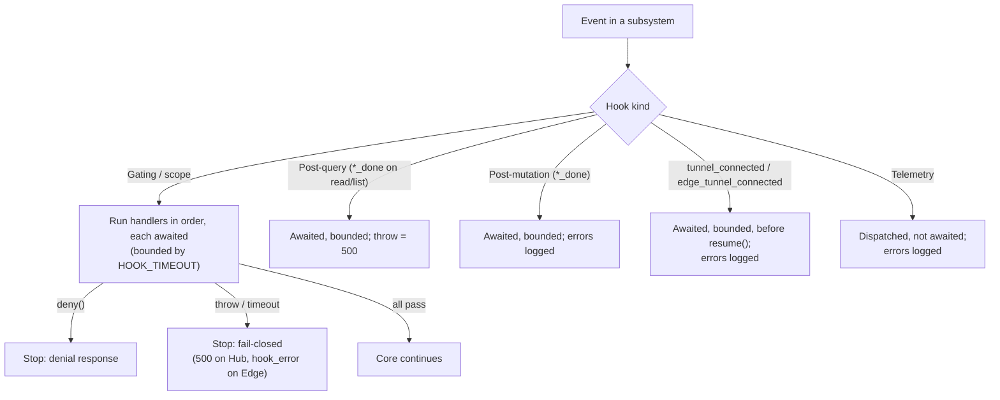

# Hooks Catalog



## Overview

Hooks are the only extension mechanism. The core is open by default; authentication, authorization, rate limiting, auditing, and metrics are all added with hooks. Terms are defined in the [Glossary](../1-concepts/glossary.md).

## Naming Conventions

* `hub_*`: Hub ingress (`hub_request`, `hub_upgrade`).
* `rest_access`, `scope_<table>`, `<operation>_<table>`: REST control plane, where `<table>` is `tunnel` or `edge` and `<operation>` is `create`, `update`, `delete`, or `roll_token`.
* `<operation>_<table>_done`: runs after the operation has completed (`list`, `read`, `create`, `update`, `delete`, `roll_token`).
* `tunnel_*`: runtime sessions on the Hub.
* `lifeline_*`: Edge lifelines, observed on the Hub.
* `edge_tunnel_*`: sessions on the Edge daemon.
* `log`: logger output.

## Execution Model

Handlers registered for the same hook run sequentially, in registration order.

| Kind | Awaited | Bounded by `HOOK_TIMEOUT` | On throw or timeout | Can deny |
| :--- | :--- | :--- | :--- | :--- |
| Gating and scope hooks | Yes | Yes | **Fail-closed**: Hub responds `500`; Edge fails the order with `hook_error` | Yes |
| Post-query hooks (`list_*_done`, `read_*_done`) | Yes | Yes | **Fail-closed**: `500`, no data returned | Yes |
| Post-mutation hooks (`create_*_done`, `update_*_done`, `delete_*_done`, `roll_token_*_done`) | Yes | Yes | Fail-open: logged; the committed change is still reported | No |
| `tunnel_connected`, `edge_tunnel_connected` | Yes, before streams resume | Yes | Fail-open: logged; the session proceeds | No |
| Telemetry hooks (`tunnel_start`, `tunnel_end`, `lifeline_disconnect`, `edge_tunnel_start`, `edge_tunnel_timeout`, `edge_tunnel_end`, `log`) | No: dispatched after the core action | No | Fail-open: logged | No |

* Denial: a Hub hook calls `req.deny(statusCode = 403, reason = "Denied", headers?)`. Use `403` for policy and `429` for rate limits; `401` is reserved for the core (Edges treat it as a revoked credential). An Edge hook calls `context.deny()`; the order fails with `hook_denied`.
* After each gating handler the core checks `req.denied` / `context.denied` and stops at the first denial.
* A hanging telemetry handler never delays a session, because telemetry hooks are not awaited on the data path.

### Argument Conventions

The first argument to every hook callback is consistently the caller/context object:
* Hub HTTP and tunnel hooks receive `req` (`IncomingMessageWithDeny`, carrying `req.id`, `clientIp`, and `correlationId`).
* Edge hooks receive `context` (`EdgeRequestContext`, carrying `context.reqId`, `ticket`, and client metadata).
* System-level telemetry hooks without an incoming HTTP request context (`lifeline_disconnect` when a lifeline drops, or `log` for logger records) pass `null` as the first argument (`(null, edge, reason)` and `(null, entry)`), ensuring uniform handler signatures.

## Catalog

### Hub

| Hook | Kind | Runs in | Arguments | Trigger |
| :--- | :--- | :--- | :--- | :--- |
| `hub_request` | Gating | Worker | `(req)` | Every HTTP request, before routing. |
| `hub_upgrade` | Gating | Worker | `(req)` | Every WebSocket upgrade (any path, any token type), before token resolution. May rewrite `req.headers.authorization`. |
| `rest_access` | Gating | Worker | `(req)` | Every REST request, including custom routes. |
| `scope_<table>` | Scope | Worker | `(req, query, operation)` | Before any storage read for `list`, `read`, `update`, `delete`, `roll_token`. Add conditions to `query.where`. |
| `create_<table>` | Gating | Worker | `(req, payload)` | Before insert. May modify `payload` (re-validated afterwards). |
| `update_<table>` | Gating | Worker | `(req, item, updates)` | After the scoped fetch, before update. May modify `updates` (re-validated afterwards). |
| `delete_<table>` | Gating | Worker | `(req, item)` | After the scoped fetch, before delete. For an edge, also runs `delete_tunnel` for each child tunnel. |
| `roll_token_<table>` | Gating | Worker | `(req, item)` | After the scoped fetch, before a new token is generated. |
| `list_<table>_done` | Post-query | Worker | `(req, items)` | Before serialization. Mutate `items` in place. |
| `read_<table>_done` | Post-query | Worker | `(req, item)` | Before serialization. Mutate `item` in place. |
| `create_<table>_done` | Post-mutation | Worker | `(req, item)` | After insert; `item` includes the new token. |
| `update_<table>_done` | Post-mutation | Worker | `(req, item)` | After update. |
| `delete_<table>_done` | Post-mutation | Worker | `(req, item)` | After delete (also once per cascaded tunnel). |
| `roll_token_<table>_done` | Post-mutation | Worker | `(req, item)` | After a roll; `item` includes the new token. |
| `tunnel_request` | Gating | Worker | `(req, tunnel)` | Runtime socket with a valid tunnel token, before Edge checks and upgrade. |
| `tunnel_start` | Telemetry | Worker | `(req, tunnel)` | Upgrade accepted. Exactly one `tunnel_end` follows. |
| `tunnel_connected` | Connected | Worker | `(req, tunnel, remoteSocket, targetSocket)` | Both streams established, before they resume. `remoteSocket` is the runtime duplex; `targetSocket` is the target socket (direct) or relayed duplex. |
| `tunnel_end` | Telemetry | Worker | `(req, tunnel, reason)` | Session ended. `reason` is from the [taxonomy](../1-concepts/protocol-spec.md#close-reason-taxonomy). |
| `lifeline_connect` | Gating | Worker | `(req, edge)` | Lifeline with a valid edge token, before upgrade. |
| `lifeline_disconnect` | Telemetry | Lifeline worker | `(null, edge, reason)` | Lifeline closed (`heartbeat_timeout`, `superseded`, `token_rolled`, `edge_deleted`, `hub_shutdown`, `client_close`). |
| `log` | Telemetry | Primary and workers | `(null, entry)` | Every emitted log entry. See [Logger](../3-subsystems/logger.md). |

### Edge

| Hook | Kind | Runs in | Arguments | Trigger |
| :--- | :--- | :--- | :--- | :--- |
| `edge_tunnel_request` | Gating | Edge worker | `(context, tunnel)` | Order received, before any dial. |
| `edge_tunnel_start` | Telemetry | Edge worker | `(context, tunnel)` | Order accepted and dialing begun. Exactly one `edge_tunnel_end` follows. |
| `edge_tunnel_connected` | Connected | Edge worker | `(context, tunnel, remoteSocket, targetSocket)` | Relayed socket and target socket both open, before they resume. |
| `edge_tunnel_timeout` | Telemetry | Edge worker | `(context, tunnel)` | The order's `connectTimeoutMs` expired before the target connected. |
| `edge_tunnel_end` | Telemetry | Edge worker | `(context, tunnel, reason)` | Session ended or order failed after start. Fires exactly once per session that passed `edge_tunnel_request` (pairing with `edge_tunnel_start`). Does not fire for orders denied during gating. |

"Edge worker" means the single process when the Edge runs with `WORKERS = 1`.

## Types

```typescript
import type { IncomingMessage } from "node:http";
import type { Duplex } from "node:stream";

export interface IncomingMessageWithDeny extends IncomingMessage {
  id: string;                 // Hub-generated request id
  clientIp: string;           // see HTTP Server: Client IP Resolution
  correlationId?: string;     // client x-request-id, if any
  denied: boolean;
  deny(statusCode?: number, reason?: string, headers?: Record<string, string>): void;
}

export interface EdgeRequestContext {
  reqId: string;
  ticket: string;
  client: { ip: string; correlationId?: string };
  denied: boolean;
  deny(): void;               // the order fails with hook_denied
}

/** The tunnel as seen by the Edge: no token, no edgeId. */
export interface EdgeTunnel {
  id: string;
  name: string;
  internalHost: string;
  internalPort: number;
  metadata: Record<string, any>;
}

export type ScopeOperation = "list" | "read" | "update" | "delete" | "roll_token";
```

`QueryContext` and `WhereCondition` are defined in the [Storage Layer](../3-subsystems/storage-layer.md#storageprovider). `Tunnel` and `Edge` are defined in [Entity Schemas](../3-subsystems/entity-schemas.md).

## Registering Hooks

```typescript
import { registerHook } from "../server/src/utils/hooks.ts";

const unsubscribe = registerHook("tunnel_end", (req, tunnel, reason) => {
  process.stdout.write(`${tunnel.name} closed: ${reason}\n`);
});

unsubscribe(); // removes the handler
```

`registerHook` throws on an unknown hook name, so typos fail at startup instead of silently never running.

## Loading Plugins

A plugin is a module whose top-level code registers hooks or routes. Plugins import from the server's source tree (`server/src/...`); there is no separate package.

```bash
node server/src/main.ts --plugin ./plugins/auth.ts,./plugins/metrics.ts
PLUGINS="./plugins/auth.ts,./plugins/metrics.ts" node server/src/main.ts
```

Or embed the server in your own entry file:

```typescript
// server.ts
import "./plugins/auth.ts";
import "./plugins/metrics.ts";
import { start } from "./tunnels/server/src/index.ts";

await start();
```

Paths are resolved from the working directory. Plugins are imported **before** the server starts listening, **in the Primary and in every worker**. Hooks only fire in the process where their event happens (see the "Runs in" columns), so:

* in-memory plugin state (counters, maps) is per process: in clustered mode, aggregate through the KV store or an external system;
* code with side effects at import time (opening connections, timers) runs once per process.
