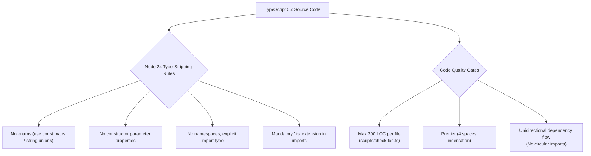

# Code Standards & Syntax Guidelines



## Overview

FullStacked Tunnels is built for high reliability, zero-overhead execution, and frictionless tinkering. To ensure the codebase remains maintainable, modular, and performant as it expands, all development follows strict syntax, style, and architectural rules.

---

## 1. Syntax & Formatting Rules

Code formatting is enforced across the entire repository with **Prettier**.

### Configuration

| Property | Value | Rationale |
| :--- | :--- | :--- |
| `tabWidth` | `4` | 4 spaces per indentation level for clear visual hierarchy across deeply nested callbacks or stream pipelines. |
| `useTabs` | `false` | Spaces ensure uniform appearance across all editors, terminals, and git viewers. |
| `semi` | `true` | Explicit semicolons prevent Automatic Semicolon Insertion (ASI) bugs in stream piping and chained promises. |
| `singleQuote` | `false` | Double quotes for consistency with JSON, HTML, and protocol messages. |
| `trailingComma` | `"es5"` | Trailing commas in multi-line objects/arrays produce cleaner git diffs. |
| `printWidth` | `100` | Avoids cramped lines while keeping code readable on split-screen displays. |
| `arrowParens` | `"always"` | `(arg) => ...` avoids ambiguity and simplifies TypeScript type annotations. |

### Import Conventions

1. **Explicit `node:` Protocol**: Built-in Node modules must always use the `node:` protocol prefix:
   ```typescript
   // ❌ Avoid
   import net from "net";
   import { pipeline } from "stream";

   // ✅ Required
   import net from "node:net";
   import { pipeline } from "node:stream";
   import crypto from "node:crypto";
   ```

2. **Mandatory Type-Only Imports**: Any import used solely for type annotations must use `import type`:
   ```typescript
   import type { IncomingMessage } from "node:http";
   import type { Duplex } from "node:stream";
   import type { Tunnel, Edge } from "./entities/index.ts";
   ```

3. **Mandatory File Extensions**: All relative imports must include the explicit `.ts` extension for native Node.js ES module resolution:
   ```typescript
   import { storage } from "./storage/index.ts";
   import { registerHook } from "./utils/hooks.ts";
   ```

---

## 2. File Size & LOC (Lines of Code) Budget

High-performance networking servers easily become unmaintainable when socket handling, stream buffering, IPC, and business logic are packed into monolithic files.

| Metric | Upper Limit | Action on Breach |
| :--- | :--- | :--- |
| **Max Lines of Code per File** | **300 LOC** | Decompose the module into focused single-responsibility files. |
| **Max Function Length** | **40–50 LOC** | Extract pipeline stages, error handlers, or helpers. |
| **Max Cyclomatic Complexity** | **10 per function** | Replace deeply nested `if/else` ladders with lookup tables or state transitions. |

> [!NOTE]
> The 300 LOC limit counts logical code lines (ignoring whitespace and full-line comments). It is automatically enforced in CI and pre-commit checks via `npm run check:loc`.

### Module Decomposition Patterns

When a subsystem approaches 250 LOC, split it into dedicated modules within a subsystem folder:

* **Warden Decomposition**:
  - `warden/lifeline.ts`: Handles lifeline upgrade, heartbeat, and presence.
  - `warden/orders.ts`: Handles order generation (`connect_tunnel`, `cancel_tunnel`), saturation checks.
  - `warden/tickets.ts`: Handles ticket creation, claiming (`kv.getdel`), and tombstones.
  - `warden/migration.ts`: Handles clustered socket migration between workers via Primary IPC.
  - `warden/index.ts`: Public `acquireRelayedStream`, `wardenLifeline`, `wardenRelayedSocket`.
* **Storage Decomposition**:
  - `storage/interface.ts`: `StorageProvider`, `Item`, `QueryContext`, `WhereCondition`.
  - `storage/filesystem.ts`: Filesystem provider (coalescing, atomic rename, shared lock mode).
  - `storage/postgresql.ts`: PostgreSQL pool and Drizzle ORM provider.
  - `storage/index.ts`: Provider initialization and factory.
* **Tunnel Handler Decomposition**:
  - `tunnels/direct.ts`: TCP connect and direct stream splicing.
  - `tunnels/registry.ts`: Active session index by `tunnelId` / `edgeId` and revocation triggers.
  - `tunnels/splicing.ts`: Stream pipeline attachment, telemetry hook runners, and teardown logic.
  - `tunnels/index.ts`: Ingress handler for `tun_` runtime upgrades.

---

## 3. File & Directory Naming Logic

Consistency in file names allows intuitive codebase exploration and prevents casing issues across macOS (case-insensitive) and Linux (case-sensitive).

### Naming Conventions

1. **Directories**: Lowercase kebab-case:
   - `docs/1-concepts/`, `server/src/tunnel-handlers/`, `server/src/key-value-store/`.
2. **Source Files**: Lowercase kebab-case:
   - `filesystem-kv.ts`, `track-bandwidth.ts`, `socket-migration.ts`.
3. **Well-Known Exceptions**:
   - `main.ts`: Executable entry points (`server/src/main.ts`).
   - `index.ts`: Barrel export files for a directory.
   - `drizzle.config.ts`: Configuration file for Drizzle Kit.
4. **Interfaces & Types**:
   - Placed in `interface.ts` or `types.ts` within the respective subsystem.
5. **Test Files**:
   - Named `<component>.test.ts` (e.g., `storage.test.ts`, `warden.test.ts`, `relay.test.ts`).

---

## 4. Node 24+ Native TypeScript Execution Constraints

The project runs TypeScript files directly with Node.js 24 LTS built-in type stripping (`node server/src/main.ts`) without transpilation or build steps during development.

Because Node 24 type stripping **erases types without generating JavaScript code**, any TypeScript syntax that produces runtime artifacts is strictly forbidden:

### Forbidden Syntax vs Allowed Alternatives

| Forbidden Feature | Reason | Allowed Alternative |
| :--- | :--- | :--- |
| `enum Foo { ... }` | Generates runtime objects. | Use `const` object maps with `as const` and union types: <br> `export const CLOSE_CODES = { normal: 1000 } as const;` <br> `export type CloseCode = typeof CLOSE_CODES[keyof typeof CLOSE_CODES];` |
| `constructor(public x: number)` | Requires parameter property transform. | Explicitly declare class properties and assign in the constructor body. |
| `namespace Foo { ... }` | Generates runtime functions/objects. | Use standard ES module exports (`export function ...`). |
| Ambiguous value/type imports | May cause runtime `ReferenceError`. | Always use `import type { ... }` for types and interfaces. |
| Unadorned relative imports | Node ESM resolution requires file paths. | Explicit `.ts` extension: `import { x } from "./x.ts";`. |

---

## 5. Architectural Boundaries & Quality Rules

1. **Unidirectional Dependency Flow**:
   - Ingress (`http`, `ws`) → Routing (`api`, `tunnels`, `warden`) → Data (`schemas`, `storage`, `kv`) → Utilities (`logger`, `hooks`).
   - **Circular dependencies are strictly forbidden**. Lower-level subsystems (storage, KV, logger) must never import from higher-level subsystems (tunnels, API, ingress).
2. **Deterministic Error Taxonomy**:
   - Any close frame sent over WebSocket or passed to an end-of-session hook must use one of the exact strings from the [Close Reason Taxonomy](../1-concepts/protocol-spec.md#close-reason-taxonomy).
   - Arbitrary error strings or formatted error descriptions must be logged via `logger.error` or `logger.warn`, never sent as close reasons.
3. **No Floating Promises**:
   - Every `Promise` must be awaited or explicitly attached with `.catch(err => ...)` to avoid silent unhandled promise rejections.
4. **Preserve Request Context**:
   - Always pass the generated `reqId` and `worker` identity down through logs and IPC payloads to ensure end-to-end post-mortem traceability.
