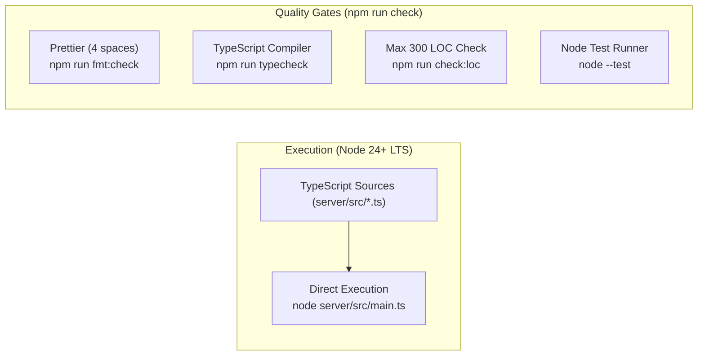

# Workflow & Tooling



## Overview

FullStacked Tunnels is built to run TypeScript sources directly in Node.js 24+ LTS with zero transpilation or build steps. This page details the direct execution workflow, automated quality checks, and testing practices.

---

## 1. Direct Node Execution

Node.js 24 LTS natively strips types from `.ts` files on the fly. No build step, file watcher, or transpile daemon is needed:

```bash
# Run Hub in development (port 3000, filesystem storage)
node server/src/main.ts --port 3000

# Run Edge (connecting to local Hub)
HUB_URL="ws://localhost:3000" TOKEN="edg_12345..." node server/src/main.ts
```

All source changes take effect immediately on process restart.

---

## 2. Automation Scripts (`package.json`)

The project uses standard scripts for all routine tasks:

```json
{
    "scripts": {
        "start": "node server/src/main.ts",
        "fmt": "prettier --write .",
        "fmt:check": "prettier --check .",
        "typecheck": "tsc --noEmit",
        "check:loc": "node scripts/check-loc.ts --max 300",
        "check": "npm run fmt:check && npm run typecheck && npm run check:loc",
        "test": "node --test server/test/*.test.ts"
    },
    "prettier": {
        "tabWidth": 4,
        "useTabs": false,
        "semi": true,
        "singleQuote": false,
        "trailingComma": "es5",
        "printWidth": 100,
        "arrowParens": "always"
    }
}
```

---

## 3. LOC Enforcement Script (`scripts/check-loc.ts`)

To ensure that the 300 LOC budget documented in [Standards](standards.md#2-file-size--loc-lines-of-code-budget) is respected, a zero-dependency script inspects all files:

```typescript
import fs from "node:fs";
import path from "node:path";

const MAX_LOC = parseInt(process.argv[3] || "300", 10);
const SRC_DIR = path.resolve(import.meta.dirname, "../server/src");

function countLoc(filePath: string): number {
    const content = fs.readFileSync(filePath, "utf-8");
    return content
        .split("\n")
        .map((line) => line.trim())
        .filter(
            (line) =>
                line.length > 0 &&
                !line.startsWith("//") &&
                !line.startsWith("/*") &&
                !line.startsWith("*")
        ).length;
}

function scanDir(dir: string): boolean {
    let ok = true;
    for (const entry of fs.readdirSync(dir, { withFileTypes: true })) {
        const fullPath = path.join(dir, entry.name);
        if (entry.isDirectory()) {
            if (!scanDir(fullPath)) ok = false;
        } else if (entry.isFile() && fullPath.endsWith(".ts")) {
            const loc = countLoc(fullPath);
            if (loc > MAX_LOC) {
                console.error(
                    `❌ [LOC Limit Exceeded] ${path.relative(process.cwd(), fullPath)}: ${loc} LOC (limit is ${MAX_LOC})`
                );
                ok = false;
            }
        }
    }
    return ok;
}

if (!scanDir(SRC_DIR)) {
    console.error(`\nPlease decompose files exceeding ${MAX_LOC} LOC according to docs/5-development/standards.md`);
    process.exit(1);
}
console.log(`✅ All source files in server/src are within the ${MAX_LOC} LOC limit.`);
```

---

## 4. Quality & Testing Practices

### A. Pre-Commit Quality Gate

To prevent broken code or misformatted files from entering git history, enable a lightweight pre-commit hook (e.g. with `simple-git-hooks` or native `.git/hooks/pre-commit`):

```bash
#!/bin/sh
npm run check
```

Because `npm run check` runs Prettier check, TypeScript typecheck, and LOC verification in memory, it completes in under 1 second.

### B. Fast Multi-Worker Tests Without External Databases

Unit and integration tests for multi-process clustering should use `ALLOW_FILESYSTEM_MULTIWORKER=true` (see [Test Mode](../2-nodes/configuration.md#test-mode-multi-worker-without-postgresql-or-redis)).
* Assign each test run a temporary folder (`DATA_DIR=$(mktemp -d)`).
* Exercise raw socket migration, IPC between Primary and workers, saturation, and worker crashes without launching PostgreSQL or Redis containers.

### C. Testing with Native Node Test Runner

Tests are written using Node.js built-in `node:test` and `node:assert/strict`:

```typescript
import test from "node:test";
import assert from "node:assert/strict";

test("ticket is claimed atomically exactly once", async () => {
    // test logic
});
```

* Zero third-party test framework overhead (no Jest, no Mocha).
* Compatible with native Node 24 TypeScript type stripping.

### D. Architectural Boundary Checks

To maintain clean separation of concerns, verify that there are no circular dependencies:
* Ingress (`http`, `ws`) depends on Router & Handlers.
* Handlers depend on Warden, Storage, and KV.
* Storage, KV, Logger, and Hooks never depend on Handlers or Ingress.
