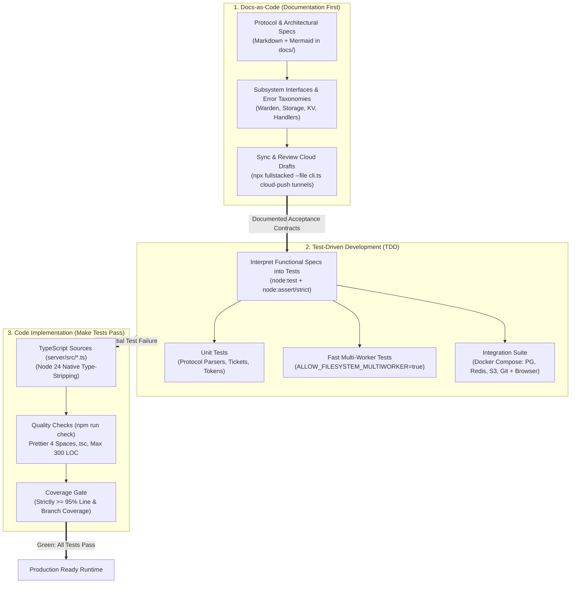
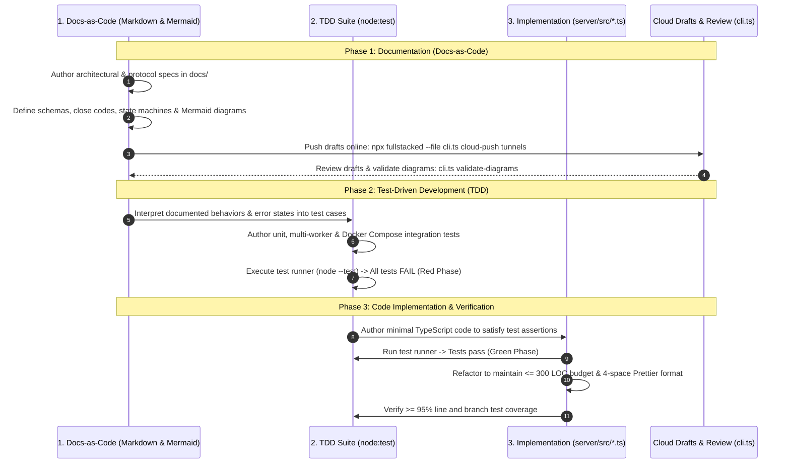

# Workflow & Tooling



## Overview

FullStacked Tunnels follows a disciplined, specification-first engineering methodology: **Docs-as-Code $\longrightarrow$ Test-Driven Development (TDD) $\longrightarrow$ Code Implementation**.

Development never begins by writing ad-hoc functional code. Instead, every protocol interaction, subsystem boundary, configuration option, and error mode is first fully documented in markdown specifications. Those specifications are then systematically interpreted into executable test suites (`node:test`) which initially fail. Finally, production TypeScript sources are authored to make the test suite pass, adhering to Node.js 24+ LTS native type stripping, Prettier formatting with 4 spaces, and a hard 300 LOC per file budget.

---

## 1. The Core Development Lifecycle



### Phase 1: Documentation (Docs-as-Code)

Every feature, protocol enhancement, or subsystem refactoring in FullStacked Tunnels **starts with documentation**:

1. **Specification as Single Source of Truth**:
   - Before any TypeScript implementation file is written or modified, the complete specification is authored in `docs/` using GitHub-flavored Markdown and Mermaid diagrams.
   - For protocol features: Define the exact frame structure, HTTP/WebSocket handshake headers, and error codes in [Protocol Spec](../1-concepts/protocol-spec.md).
   - For node topologies: Define the command-line flags, environment variables, and connection lifecycles in [Hub](../2-nodes/hub.md) and [Edge](../2-nodes/edge.md).
   - For subsystems: Define provider interfaces, data models, and operation pipelines in [Subsystems](../3-subsystems/tunnel-handlers.md).
2. **Deterministic Boundaries & Error Taxonomy**:
   - All failure scenarios, timeout windows, and edge cases must be cataloged in advance. Close codes must use exact entries from the [Close Reason Taxonomy](../1-concepts/protocol-spec.md#close-reason-taxonomy).
3. **Docs-as-Code Tooling & Online Draft Synchronization**:
   - Technical documentation is maintained directly within the repository alongside code.
   - Mermaid diagrams embedded in documentation are strictly validated using:
     ```bash
     npx fullstacked --file cli.ts validate-diagrams tunnels
     ```
   - Documentation drafts are continuously pushed and reviewed across devices using the cloud editor draft CLI:
     ```bash
     # Push all updated documentation drafts to cloud storage (S3 + PostgreSQL)
     npx fullstacked --file cli.ts cloud-push tunnels

     # Or push a specific updated document
     npx fullstacked --file cli.ts cloud-push tunnels docs/5-development/workflow.md
     ```

### Phase 2: Test-Driven Development (TDD) — Interpreting Docs into Tests

Once the documentation and architectural specifications are approved, **all defined functionalities are interpreted into tests**:

1. **Translating Specifications into Executable Contracts**:
   - Every requirement written in the documentation is directly mapped to a test case in `server/test/*.test.ts` or `server/test/integration/*.test.ts`.
   - Built on native Node.js tooling: `node:test` and `node:assert/strict` (zero third-party test framework overhead).
2. **Three-Tier Testing Hierarchy**:
   - **Unit Tests**: Test pure logic, binary frame parsers, ticket generation algorithms, and token validation.
   - **Fast Multi-Worker Tests (`ALLOW_FILESYSTEM_MULTIWORKER=true`)**: Test clustering, raw socket migration across worker processes via Primary IPC, ticket claiming (`getdel`), and worker crash recovery in memory and filesystem without external database overhead.
   - **Zero-Mock Integration Tests**: Test real-world protocol interoperability against live containerized services via Docker Compose (PostgreSQL, Redis, MySQL, MongoDB, RustFS S3, Git server, HTTP/socket servers) and automated in-browser client testing via the `fullstackedorg/fullstacked` submodule.
3. **The Red Phase (Intentional Failure)**:
   - Tests are run *before* the implementation code is written (`node --test`).
   - Because the functional implementation does not yet exist, the test suite initially fails. This confirms that the tests are actively testing the documented contracts and are not giving false positives.

### Phase 3: Code Implementation (Making the Test Suite Pass)

With the comprehensive test harness in place, the production code is authored:

1. **The Green Phase (Make Tests Pass)**:
   - Write TypeScript code in `server/src/*.ts` designed specifically to satisfy the failing test cases until the entire test suite passes.
2. **Architectural & Syntactic Compliance**:
   - Code must comply with Node.js 24 native type-stripping rules: no enums (use `const` maps + union types), no parameter properties in class constructors, mandatory `.ts` file extensions, and explicit `node:` module prefixes (see [Standards](standards.md)).
   - Every file must adhere to the hard budget of **maximum 300 LOC** (enforced by `scripts/check-loc.ts`). If a module reaches 250 LOC, it must be decomposed into focused single-responsibility submodules.
   - Formatting must adhere to Prettier with 4-space tab indentation (`npm run fmt:check`).
3. **The Refactor Phase & Coverage Verification**:
   - Clean up, optimize, and modularize code while maintaining passing tests.
   - Run the coverage verification gate:
     ```bash
     node --test --experimental-test-coverage
     ```
   - FullStacked Tunnels strictly enforces a minimum of **95% code coverage at all times** across all lines, functions, and branches before code can be accepted.

---

## 2. Direct Node Execution

Node.js 24 LTS natively strips types from `.ts` files on the fly. No build step, file watcher, or transpile daemon is needed:

```bash
# Run Hub in development (port 3000, filesystem storage)
node server/src/main.ts --port 3000

# Run Edge (connecting to local Hub)
HUB_URL="ws://localhost:3000" TOKEN="edg_12345..." node server/src/main.ts
```

All source changes take effect immediately on process restart.

---

## 3. Automation Scripts (`package.json`)

The project uses standard scripts for all routine tasks:

```json
{
    "scripts": {
        "start": "node server/src/main.ts",
        "fmt": "prettier --write .",
        "fmt:check": "prettier --check .",
        "typecheck": "tsc --noEmit",
        "check:loc": "node scripts/check-loc.ts --max 300",
        "check": "npm run fmt:check && npm run typecheck && npm run check:loc",
        "test": "node --test server/test/*.test.ts",
        "test:integration": "docker compose -f docker-compose.test.yml up -d && node --test server/test/integration/*.test.ts"
    },
    "prettier": {
        "tabWidth": 4,
        "useTabs": false,
        "semi": true,
        "singleQuote": false,
        "trailingComma": "es5",
        "printWidth": 100,
        "arrowParens": "always"
    }
}
```

---

## 4. LOC Enforcement Script (`scripts/check-loc.ts`)

To ensure that the 300 LOC budget documented in [Standards](standards.md#2-file-size--loc-lines-of-code-budget) is respected, a zero-dependency script inspects all files:

```typescript
import fs from "node:fs";
import path from "node:path";

const MAX_LOC = parseInt(process.argv[3] || "300", 10);
const SRC_DIR = path.resolve(import.meta.dirname, "../server/src");

function countLoc(filePath: string): number {
    const content = fs.readFileSync(filePath, "utf-8");
    return content
        .split("\n")
        .map((line) => line.trim())
        .filter(
            (line) =>
                line.length > 0 &&
                !line.startsWith("//") &&
                !line.startsWith("/*") &&
                !line.startsWith("*")
        ).length;
}

function scanDir(dir: string): boolean {
    let ok = true;
    for (const entry of fs.readdirSync(dir, { withFileTypes: true })) {
        const fullPath = path.join(dir, entry.name);
        if (entry.isDirectory()) {
            if (!scanDir(fullPath)) ok = false;
        } else if (entry.isFile() && fullPath.endsWith(".ts")) {
            const loc = countLoc(fullPath);
            if (loc > MAX_LOC) {
                console.error(
                    `❌ [LOC Limit Exceeded] ${path.relative(process.cwd(), fullPath)}: ${loc} LOC (limit is ${MAX_LOC})`
                );
                ok = false;
            }
        }
    }
    return ok;
}

if (!scanDir(SRC_DIR)) {
    console.error(`\nPlease decompose files exceeding ${MAX_LOC} LOC according to docs/5-development/standards.md`);
    process.exit(1);
}
console.log(`✅ All source files in server/src are within the ${MAX_LOC} LOC limit.`);
```

---

## 5. Quality & Testing Practices

### A. Pre-Commit Quality Gate

To prevent broken code or misformatted files from entering git history, enable a lightweight pre-commit hook (e.g. with `simple-git-hooks` or native `.git/hooks/pre-commit`):

```bash
#!/bin/sh
npm run check
```

Because `npm run check` runs Prettier check, TypeScript typecheck, and LOC verification in memory, it completes in under 1 second.

### B. Fast Multi-Worker Tests Without External Databases (Unit, E2E & Code Coverage)

The multi-worker test mode (`ALLOW_FILESYSTEM_MULTIWORKER=true`, see [Test Mode](../2-nodes/configuration.md#test-mode-multi-worker-without-postgresql-or-redis)) is built specifically for rapid developer feedback and CI pipelines:
* **Ideal for Unit & E2E Testing**: Runs in milliseconds without booting external database containers or heavyweight background daemons.
* **95% Code Coverage at All Times**: Perfect for gathering complete line and branch coverage across core routing, socket migration, and process lifecycle logic. The project strictly maintains a minimum of **95% code coverage at all times**.
* **Isolated Environments**: Assign each test run a temporary folder (`DATA_DIR=$(mktemp -d)`) to execute in complete isolation.
* **Clustering & IPC Verification**: Exercises raw socket migration, inter-process communication (IPC) between Primary and worker processes, connection saturation, and worker crash recovery entirely in memory and filesystem.

### C. Strong Integration Test Suite with Real Services (Docker Compose & Submodule)

In addition to fast multi-worker tests, FullStacked Tunnels requires a robust, zero-mocking **integration test suite** to validate real-world production interoperability across diverse protocols and client runtimes:

#### 1. Real Services via Docker Compose (No Mocking)

The integration test suite launches genuine, containerized services using Docker Compose with zero mock layers:
* **MySQL**: Validates relational database wire protocol forwarding, packet boundary handling, and persistent transactional queries piped across tunnels.
* **Redis**: Validates in-memory caching commands, high-throughput Pub/Sub message channels, connection multiplexing, and distributed cluster coordination.
* **PostgreSQL**: Validates Hub/Edge persistent metadata, schema migrations, transactional guarantees, and connection pooling.
* **Basic HTTP Server**: Validates HTTP/1.1 and HTTP/2 handling, chunked transfer encoding, streaming payloads, Server-Sent Events (SSE), and strict header preservation.
* **Basic Socket Server**: Validates raw TCP socket proxies and WebSocket servers, testing duplex streaming, heartbeats, reconnects, and socket backpressure.
* **S3 Object Storage via [RustFS](https://github.com/rustfs/rustfs)**: Uses RustFS (high-performance S3-compatible storage written in Rust) to test multipart uploads, chunked binary payloads, bucket management, and presigned URL access over reverse-proxied tunnels.
* **Git Server**: Validates Git Smart HTTP and SSH/TCP protocols, verifying `git clone`, `git push`, `git pull`, and packfile negotiation over edge-to-hub tunnels.
* **MongoDB**: Validates native MongoDB wire protocol (OP_MSG, BSON serialization) connection pooling, query cursor streaming, and failover behavior.

#### 2. Submodule Integration (`fullstackedorg/fullstacked`)

The repository includes [`fullstackedorg/fullstacked`](https://github.com/fullstackedorg/fullstacked) as a Git submodule to build and test end-to-end functionality against live tunnels:
* **Node.js Imported Scripts**: Programmatic test harnesses import FullStacked packages directly to automate service instantiation, manage tunnel lifecycles, and assert protocol fidelity.
* **In-Browser Testing**: Tests directly in the browser to test as close to a real-case scenario as possible.

This comprehensive integration suite ensures everything remains fully functional across the board—from low-level TCP/wire protocols to real in-browser user interactions.

### D. Testing with Native Node Test Runner

Tests are written using Node.js built-in `node:test` and `node:assert/strict`:

```typescript
import test from "node:test";
import assert from "node:assert/strict";

test("ticket is claimed atomically exactly once", async () => {
    // test logic
});
```

* Zero third-party test framework overhead (no Jest, no Mocha).
* Compatible with native Node 24 TypeScript type stripping.
* Built-in code coverage reporting (`node --test --experimental-test-coverage`) ensures the mandatory 95% code coverage threshold is strictly enforced at all times.

### E. Architectural Boundary Checks

To maintain clean separation of concerns, verify that there are no circular dependencies:
* Ingress (`http`, `ws`) depends on Router & Handlers.
* Handlers depend on Warden, Storage, and KV.
* Storage, KV, Logger, and Hooks never depend on Handlers or Ingress.

